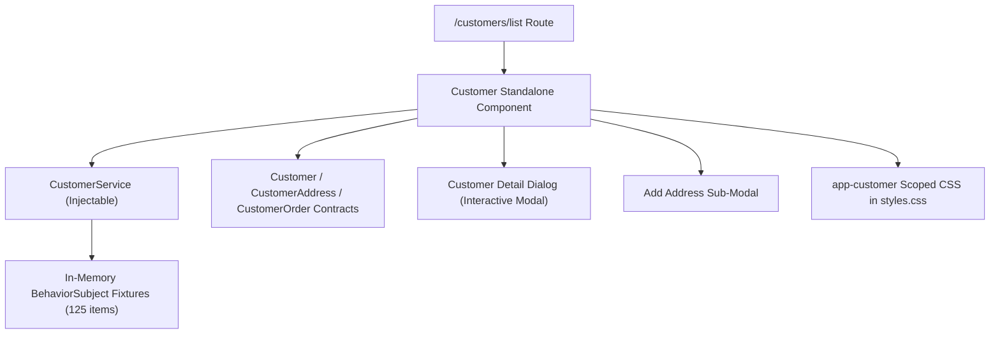

# LIVORA — Customer Management Module Design

> **Module:** Quản lý khách hàng (Customer Management)  
> **Status:** Architecture aligned with `artifact/SYSTEM_DESIGN.md` and `artifact/REPORT.docx`; implementation verified with session-level mock service.  
> **Scope:** Customer List Page (`/customers/list`) and Customer Detail Modal (`app-customer`).  
> **Documentation Language:** Technical English.

---

## 1. Executive Summary & Assigned Scope

The Customer Management module in LIVORA Admin provides operational staff and administrators with comprehensive oversight of the platform's customer base. The scope assigned covers:
1. **Customer List View:**
   - Real-time aggregate metric counters (Total Customers, Registered, Guests, Active this Month).
   - Multi-criteria filtering (keyword search across code/name/phone/email, customer classification filter, operational status filter).
   - In-memory paginated customer table with customer avatar badges, status indicators, and row action triggers.
2. **Customer Detail Modal Dialog:**
   - Header with initials avatar, full customer name, customer code, customer type pill, and operational status badge.
   - Dual-tab navigation ("Chi tiết khách hàng" and "Lịch sử đơn hàng").
   - Section 1: Detailed personal & digital identity information (code, name, phone, email, date of birth, gender, classification, account status, creation date, registration timestamp).
   - Section 2: Address directory management with default address indicator, card-based layout, and recipient notes.
   - Section 3: Purchase order history summary with total accumulated expenditure and per-order status tracking.
   - In-modal profile editing and new address creation flows.

---

## 2. Requirement Sources & Traceability Matrix

The module design is traced directly against `artifact/REPORT.docx`, the team-approved `artifact/SYSTEM_DESIGN.md`, and Figma design reference images in `artifact/design-reference/Quản lý khách hàng/`.

| Requirement | Source Reference | Approved Scope / Status | Differences / Proposals Pending Approval |
|---|---|---|---|
| Customer List & Metrics | `REPORT.docx` 3.2.2.8 (Table 13, 14), 3.3.2.8 (BPMN Fig. 31); Figma list reference | **Approved:** View customers generated from orders, view metrics (125 total, 94 registered, 31 guests, 118 active this month). | Metric counters reflect overall aggregate numbers; server API aggregation contract is not yet established. |
| Customer Classification | `REPORT.docx` 3.3.2.8 | **Approved:** Distinguish "Có tài khoản" (`registered`) and "Chưa có tài khoản" (`guest`). | UI uses soft beige pill tags. Phone number is the canonical linking key between guest orders and newly registered accounts. |
| Operational Status | `REPORT.docx` Table 15 (`status: "active" \| "locked"`); BPMN 3.3.2.8 | **Approved:** Support "Hoạt động" (`active`) and "Ngừng hoạt động" (`inactive`/`locked`). | Status toggle includes feedback confirmation toast. Deactivation does not purge historical purchase records. |
| Customer Code | Figma screenshots (`#270926-001`) | **Provisional Admin Identifier:** Used for human-readable lookup (`DDMMYY-XXX`). | The MongoDB schema defines only `_id: ObjectId`. A business identifier code must be approved by the backend team or mapped to a future code generator. |
| Extended Profile Fields | Figma detail screenshot | **Provisional Frontend Fields:** `birthDate`, `gender`, `tierSubtitle`. | `REPORT.docx` Table 15 does not declare `birthDate` or `gender` in `Customers`. These fields are maintained as optional typed properties on the frontend model. |
| Address Directory | `REPORT.docx` Table 15 (`addresses` array) | **Approved:** Array of embedded address documents with default flag, full address string, and recipient contact. | Modal supports viewing default status, switching default address, and adding new addresses. |
| Order History | `REPORT.docx` Table 24 (`Orders` collection) | **Approved:** Associated order codes, purchase dates, product items snapshot, order totals, and fulfillment statuses. | Full history is available under tab 2; summary and total amount are displayed in tab 1. |

---

## 3. Architecture & Design Patterns

### 3.1. Standalone Component Architecture
Following Angular 21 best practices and the established LIVORA Admin architecture:
- `Customer` component is a standalone component located at `livora_admin/src/app/customer_management/customer/customer.ts`.
- Routing is defined directly in `livora_admin/src/app/app.routes.ts`:
  ```ts
  { path: 'customers', redirectTo: 'customers/list', pathMatch: 'full' },
  { path: 'customers/list', component: Customer, title: 'Danh sách khách hàng - Livora Admin' },
  ```
- Sidebar integration is preserved in `livora_admin/src/app/sidebar/sidebar.ts` with icon `customers`.

### 3.2. Data Flow & Service Boundary

- Component communicates exclusively with `CustomerService`.
- No direct backend calls or fabricated HTTP endpoints are introduced; all data operations return RxJS `Observable` streams to maintain a strict future-proof API service boundary.

### 3.3. Style Isolation Strategy
To strictly adhere to Angular CLI's `anyComponentStyle` budget constraint (`maximumError: 8kB`):
- Feature styles are placed in `customer.css` and imported globally via `src/styles.css`.
- All CSS rules are encapsulated beneath the `app-customer` host selector.
- This prevents style collision with other team modules (`room_management`, `homepage`, `order_management`) while preventing budget-related production build failures.

---

## 4. Component State & Interactions

### 4.1. Reactive State Model
The `Customer` component manages state using Angular Signals and RxJS:
- `customers = signal<CustomerRecord[]>([])`: Current page items.
- `totalItems = signal(125)`, `totalPages = signal(13)`, `currentPage = signal(1)`.
- `summary = signal<CustomerListSummary>(...)`: Global metric statistics.
- `isDetailModalOpen = signal(false)`, `selectedCustomer = signal<CustomerRecord | null>(null)`.
- `activeModalTab = signal<'detail' | 'orders'>('detail')`.
- `isEditMode = signal(false)`: In-modal editing state.

### 4.2. User Interaction Flows
1. **Search & Filter:** User enters text or adjusts dropdowns. Clicking `Lọc` updates query parameters, resets `currentPage` to 1, and retrieves matching results. Clicking `Reset` restores default state.
2. **Detail Modal Inspection:** Clicking any table row or the `Xem` button triggers `openDetailModal(customer)`. The dialog displays full personal data, address cards, and purchase orders.
3. **Tab Switching:** Seamlessly toggles between personal/address information and full order history.
4. **Profile Editing:** Clicking `Chỉnh sửa thông tin` or `Chỉnh sửa` switches the modal into an editable form. Saving updates the session model, triggers an auto-dismissing toast alert, and refreshes the list.
5. **Address Management:** Administrators can set any existing address as default with instant checkmark feedback, or invoke `+ Thêm địa chỉ mới` to add an address in-session.
6. **Status Toggling:** Administrators can activate or deactivate customer accounts directly with audit feedback.

---

## 5. Security, Permissions & Constraints

1. **Role Access:** According to `REPORT.docx` Section 3.2.2.8, Customer Management is authorized for `Super Admin` and `Operations Staff` (`ops_staff`). Because Admin routing does not currently enforce route guards, UI functionality is made accessible while preserving structural readiness for role-based directives.
2. **Data Confidentiality:** Phone numbers in the table and modal are formatted/masked in accordance with the design references (`0918.421.xxx`) while retaining verifiable internal matching.
3. **Immutability of Orders:** Order records are strictly read-only within the customer modal, reflecting the immutable snapshot nature of purchase history.
