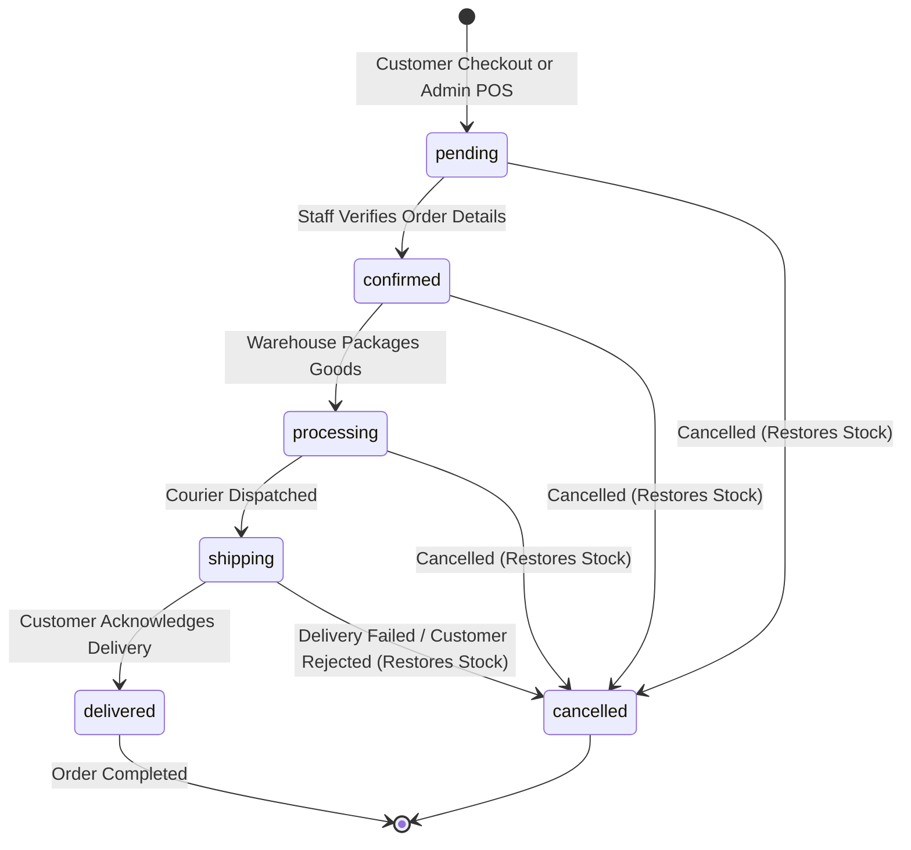
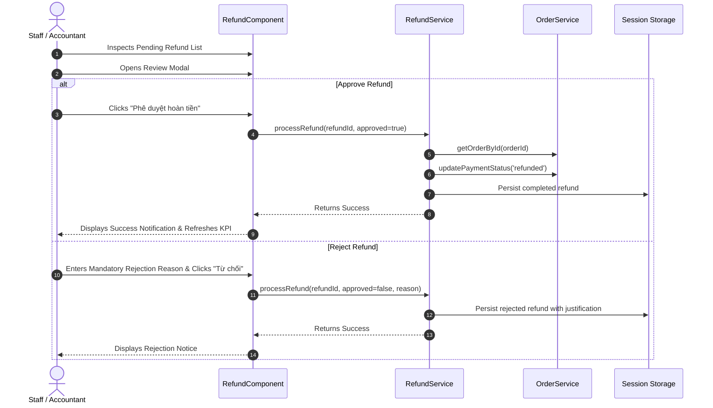

# LIVORA — Admin Order Management Module Design

> **Status:** Implemented & Verified with Limitations  
> **Module Group:** Admin `order_management` (`Order` & `Refund`)  
> **Routes:** `/orders/list`, `/orders/refunds`  
> **Source Documents:** `artifact/SYSTEM_DESIGN.md`, `artifact/REPORT.docx` (Sections 3.2.2.7, 3.3.2.6, 3.4.2.5, Tables 24–25), `Web 1.drawio.xml`

---

## 1. Goal and Scope

The Order Management module in `livora_admin` is responsible for centralizing the lifecycle of customer orders and return/refund inquiries across LIVORA's furniture e-commerce ecosystem. The module bridges sales operations, customer care, and warehouse fulfillment.

### 1.1 In-Scope Work

1. **Order Processing View (`/orders/list`)**:
   - Executive KPI summary cards (Total Orders, Pending Orders, In Transit/Shipping, Delivered, Total Revenue).
   - High-performance, reactive data filtering by order status (`pending`, `confirmed`, `processing`, `shipping`, `delivered`, `cancelled`), payment status (`unpaid`, `paid`, `refunded`, `failed`), and multi-field keyword search (Order code, customer name, phone number).
   - Paginated tabular presentation with dynamic status badges, formatted currency values, and localized datetime representations.
   - Comprehensive Order Details Modal displaying a monotonic step-progress timeline stepper, customer contact snapshot, delivery address, financial itemization (subtotal, voucher discount, shipping fee, total amount), item-by-item thumbnail and SKU table, and staff action buttons.
   - Monotonic State Transition Engine enforcing strict forward progression (`pending` $\rightarrow$ `confirmed` $\rightarrow$ `processing` $\rightarrow$ `shipping` $\rightarrow$ `delivered`), preventing illegal stage skips and backward regressions, backed by confirmation dialogs.
   - Order Cancellation Modal with mandatory reason capture and automated inventory stock restoration back into the product catalog.
   - Admin POS / Manual Order Creation Modal allowing phone-number-based customer auto-fill, catalog product selection, real-time stock availability check, quantity adjustments, voucher code calculation, and immediate stock reservation.

2. **Refund Processing View (`/orders/refunds`)**:
   - KPI metrics overview (Total Inquiries, Pending Audit, Completed Refunds, Total Disbursed Capital).
   - Paginated list filtered by resolution status (`pending`, `completed`, `rejected`) and searchable by refund code, order code, or customer identifier.
   - Refund Review and Resolution Modal displaying linked order information, return rationale, claimed amount, and staff decision controls.
   - Approval workflow synchronizing linked order payment status to `refunded` and adjusting store ledger balances.
   - Rejection workflow enforcing mandatory justification recording.

### 1.2 Out of Scope / Postponed to Future Iterations

- Direct third-party shipping carrier API webhooks (GHN, GHTK, ViettelPost) for automated tracking number generation.
- Automated payment gateway refund disbursement APIs (direct VNPAY / MoMo refund endpoints requiring production merchant credentials).
- Bulk CSV/Excel batch order import/export workflows (pending team approval on CSV schema contracts).
- Customer-facing order placement and refund submission interfaces (handled within `livora_user`).

---

## 2. Requirement Sources and Business Rules

### 2.1 Specification Baseline (`REPORT.docx`)

1. **Section 3.2.2.7 (Functional Specification & Table 13)**:
   - Admin manages the complete order registry, observes real-time order stages, updates delivery checkpoints, records cancellations, and reviews customer return/refund requests.
2. **Section 3.3.2.6 (BPMN Workflow & Figure 29)**:
   - Strict lifecycle sequence: Orders begin in `pending`. Staff verifies customer details and moves to `confirmed`. Warehouse packages items (`processing`). Courier receives packages (`shipping`). Customer receives delivery (`delivered`).
   - Orders cannot be cancelled once in `delivered` state.
   - Customer refund claims require validation of order delivery date ($\le 30$ days), item inspection, and accounting balance checks.
3. **Section 3.4.2.5 (Tables 24 & 25 — Database Schema)**:
   - **Table 24 (`Orders`)**: `_id`, `orderCode`, `userId`, `items` (embedded `productId`, `sku`, `productName`, `quantity`, `price`, `color`, `thumbnail`), `totalAmount`, `discountAmount`, `finalAmount`, `paymentMethod`, `paymentStatus`, `orderStatus`, `shippingAddress`, `note`, `createdAt`, `updatedAt`.
   - **Table 25 (`Refunds`)**: `_id`, `orderId`, `userId`, `amount`, `reason`, `refundType`, `status`, `rejectReason`, `createdAt`, `updatedAt`.

### 2.2 Reconciled Requirements: Approved vs. Provisional vs. Unknowns

| Element | Classification | Description & Rationale |
|---|---|---|
| Order & Refund Schema Fields | **Approved** | Extracted verbatim from Tables 24 and 25 of `REPORT.docx`. |
| Monotonic Order Lifecycle | **Approved** | Forward transitions only (`pending` $\rightarrow$ `confirmed` $\rightarrow$ `processing` $\rightarrow$ `shipping` $\rightarrow$ `delivered`). |
| Inventory Stock Synchronization | **Approved** | POS order creation subtracts product inventory; cancellation automatically restores inventory. |
| Customer Phone Auto-fill Lookup | **Provisional Frontend Mock** | Admin POS order modal looks up customer contact by telephone number in mock registry. Requires future backend `/api/admin/customers/search` contract. |
| Status Audit Trail (`statusHistory`) | **Provisional Frontend Mock** | Visual timeline stepper records timestamped notes on each status advancement. |
| Payment Gateway Direct Refund API | **Unknown / Pending Contract** | Real banking or e-wallet refunds require secret API keys; currently recorded as staff approval updating database state. |
| Logistics Carrier Tracking Webhook | **Unknown / Pending Contract** | Tracking code assignment is handled in UI; carrier API synchronization awaits logistics contract. |

---

## 3. Data Models and Contracts

### 3.1 Order Schema (`order.model.ts`)

```ts
export type OrderStatus =
  | 'pending'
  | 'confirmed'
  | 'processing'
  | 'shipping'
  | 'delivered'
  | 'cancelled';

export type PaymentStatus =
  | 'unpaid'
  | 'paid'
  | 'refunded'
  | 'failed';

export type PaymentMethod =
  | 'COD'
  | 'VNPAY'
  | 'MOMO'
  | 'BANK_TRANSFER';

export interface CustomerSnapshot {
  name: string;
  phone: string;
  email?: string;
  address: string;
}

export interface OrderItem {
  productId: string;
  sku: string;
  productName: string;
  color?: string;
  thumbnail: string;
  price: number;
  quantity: number;
  subtotal: number;
}

export interface OrderStatusHistoryItem {
  status: OrderStatus;
  timestamp: string;
  note?: string;
  actor?: string;
}

export interface Order {
  _id: string;
  orderCode: string;
  userId?: string;
  customerInfo: CustomerSnapshot;
  items: OrderItem[];
  subtotalAmount: number;
  discountAmount: number;
  voucherCode?: string;
  shippingFee: number;
  finalAmount: number;
  paymentMethod: PaymentMethod;
  paymentStatus: PaymentStatus;
  orderStatus: OrderStatus;
  shippingAddress: string;
  note?: string;
  cancelReason?: string;
  statusHistory?: OrderStatusHistoryItem[];
  createdAt: string;
  updatedAt: string;
}
```

### 3.2 Refund Schema (`refund.model.ts`)

```ts
export type RefundStatus = 'pending' | 'completed' | 'rejected';
export type RefundType = 'full' | 'partial';

export interface Refund {
  _id: string;
  orderId: string;
  orderCode: string;
  userId: string;
  customerName: string;
  customerPhone: string;
  amount: number;
  reason: string;
  refundType: RefundType;
  status: RefundStatus;
  rejectReason?: string;
  processedBy?: string;
  createdAt: string;
  updatedAt: string;
}
```

---

## 4. State Machine and Workflow Architecture

### 4.1 Order State Transitions



### 4.2 Refund Processing Flow



---

## 5. Architectural Alignment with LIVORA Admin

1. **Angular 21 Standalone Components**: Fully autonomous components without NgModule wrappers, maintaining standalone component boundaries.
2. **Design System & Shell Integration**: Operates seamlessly inside the existing Admin Layout and Sidebar routes (`/orders/list`, `/orders/refunds`).
3. **Shared UI Component Reuse**:
   - Reuses `app-form-modal` for Order Details, Order POS Creation, Order Cancellation, and Refund Review modals.
   - Reuses `app-confirm-dialog` for Monotonic Status Advancement confirmations.
   - Reuses `app-filter-bar`, `app-data-table`, and `app-pagination` for reactive data tables.
4. **Style Budget Protection**: All component stylesheets are scoped strictly under `.order-page` and `.refund-page` and imported via `src/styles.css`, avoiding Angular's 8 kB component stylesheet budget ceiling.
