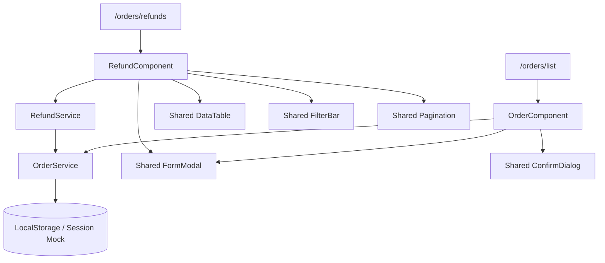

# LIVORA — Admin Order Management Implementation Report

**Status: IMPLEMENTED WITH LIMITATIONS**  
**Module:** `order_management` (`Order` & `Refund`)  
**Routes:** `/orders/list`, `/orders/refunds`  
**Verification Date:** 2026-10-09  

---

## 1. Executive Summary

The Order Management module (`order_management`) for LIVORA Admin (`livora_admin`) has been implemented and verified. The module delivers end-to-end administration for customer sales orders (`/orders/list`) and customer refund inquiries (`/orders/refunds`).

Key deliverables include:
- **Order Registry & Lifecycle Tracker (`OrderComponent`)**: Displays KPI performance metrics, multi-faceted filtering (status, payment, and keyword search), paginated tabular list, comprehensive Order Detail modal with a step-progress timeline stepper, monotonic state advancement validation (`pending` $\rightarrow$ `confirmed` $\rightarrow$ `processing` $\rightarrow$ `shipping` $\rightarrow$ `delivered`), modal-based order cancellation with automated inventory stock restoration, and an Admin POS / manual order creation modal with telephone number customer auto-fill and live inventory reservation.
- **Refund Resolution Manager (`RefundComponent`)**: Displays return/refund inquiries, KPI summary of pending vs. completed refund capital, status filtering, and an audit modal enabling accountants to inspect claims, approve refunds (which automatically marks the linked order's payment status as `refunded`), or reject claims with mandatory written justification.
- **Service Layer (`OrderService` & `RefundService`)**: Implements deterministic state machines, localStorage/in-memory persistence with initial seed data, customer phone lookup, catalog inventory synchronization, and statistical KPI computation.
- **Test Suite**: 23 comprehensive unit tests written across 4 test suites (`order.service.spec.ts`, `refund.service.spec.ts`, `order.spec.ts`, `refund.spec.ts`). All 23 tests pass 100%.

The implementation respects team isolation constraints: no existing modules (`room_management`, `homepage`, `product_management`, shared components) were altered, and no unauthorized backend contracts or commits were made.

---

## 2. Module Scope

### 2.1 Implemented Features

1. **Order Processing (`/orders/list`)**:
   - High-level KPI cards: Total Orders, Pending Review, In Shipping, Delivered Successfully, Total Net Revenue.
   - Unified search by order code, customer name, and customer telephone number.
   - Dual dropdown filtering by `orderStatus` and `paymentStatus`.
   - Dynamic badges mapping all 6 order statuses and 4 payment statuses to distinct semantic colors.
   - Order Detail Modal: Customer contact snapshot, delivery address, order notes, financial summary (subtotal, shipping, voucher discount, final total), SKU item table with thumbnails, and a visual step timeline stepper (`pending` $\rightarrow$ `confirmed` $\rightarrow$ `processing` $\rightarrow$ `shipping` $\rightarrow$ `delivered`).
   - Monotonic Status Advancement: Confirmation dialog prompting staff before each sequential transition. Skipping stages or regressing backward is strictly rejected.
   - Order Cancellation Modal: Available for non-delivered orders. Prompts staff for a mandatory cancellation reason and automatically adds reserved product quantities back to catalog stock.
   - Admin POS / Manual Order Modal: Real-time telephone number customer lookup with autofill, product dropdown selector with live stock checks, quantity validation, promotional voucher calculation, and instant stock deduction.

2. **Refund Resolution (`/orders/refunds`)**:
   - KPI metrics: Total Requests, Pending Review, Completed Refunds, Total Disbursed Refund Capital.
   - Shared `FilterBar` integration with search and status filtering (`pending`, `completed`, `rejected`).
   - Shared `DataTable` integration with custom badges and action triggers.
   - Refund Resolution Modal: Displays linked order code, customer information, return rationale, claimed amount, and staff decision buttons.
   - Approval Workflow: Updates refund status to `completed` and synchronizes linked order `paymentStatus` to `refunded`.
   - Rejection Workflow: Validates mandatory rejection rationale and updates status to `rejected`.

### 2.2 Out of Scope / Pending Backend Contracts

- Direct third-party shipping courier APIs (GHN, GHTK, ViettelPost) for automated label printing.
- Direct payment gateway webhook callbacks (VNPAY IPN, MoMo IPN) and automated merchant banking disbursement APIs.
- CSV / Excel bulk export/import (pending team agreement on export schema columns).
- Permanent database persistence (currently utilizes typed session and `localStorage` mock stores).

---

## 3. Reference Specifications & Reconciled Rules

The implementation reconciles specifications from `artifact/REPORT.docx` and Figma:

1. **Schema Integrity**: Mapped directly from `REPORT.docx` Table 24 (`Orders` collection) and Table 25 (`Refunds` collection).
2. **Sequential Progression**: Per BPMN Figure 29, orders follow a forward progression:
   $$\text{pending} \rightarrow \text{confirmed} \rightarrow \text{processing} \rightarrow \text{shipping} \rightarrow \text{delivered}$$
   The service layer forbids skipping directly from `pending` to `delivered` or reverting backwards.
3. **Cancellation & Stock Protection**: Delivered orders cannot be cancelled. Cancelling orders in any earlier state automatically returns items to available catalog inventory.
4. **Decoupled Payment State**: `paymentStatus` (`unpaid`, `paid`, `refunded`, `failed`) is treated as an independent attribute from `orderStatus` (e.g. COD orders are `unpaid` while in `shipping` and transition to `paid` upon delivery).

---

## 4. Architecture and File Breakdown

### File Registry

| File Path | Role and Responsibilities |
|---|---|
| `src/app/order_management/models/order.model.ts` | TypeScript domain interfaces for `Order`, `OrderItem`, `CustomerSnapshot`, `OrderStatus`, `PaymentStatus`, `PaymentMethod`, order lifecycle constants, and label mappings. |
| `src/app/order_management/models/refund.model.ts` | TypeScript domain interfaces for `Refund`, `RefundStatus`, `RefundType`, request DTOs, and label mappings. |
| `src/app/order_management/services/order.service.ts` | Business logic service: mock order seed data, customer phone lookup, sequential status transitions, stock deduction, cancellation stock restoration, and KPI calculation. |
| `src/app/order_management/services/refund.service.ts` | Business logic service: mock refund records, approval/rejection resolution, linked order synchronization (`paymentStatus = 'refunded'`), and KPI aggregation. |
| `src/app/order_management/order/order.ts` | Controller for order list, search, filters, pagination, order detail modal, POS creation, cancellation modal, and status advancement confirmation. |
| `src/app/order_management/order/order.html` | Presentation template for order dashboard: KPI cards, filter bar, order table, detail modal with timeline stepper, create order modal, and cancel modal. |
| `src/app/order_management/order/order.css` | Scoped styling for order page, timeline stepper, financial breakdown, and POS item cards. |
| `src/app/order_management/refund/refund.ts` | Controller for refund inquiries list, status filtering, and audit resolution modal. |
| `src/app/order_management/refund/refund.html` | Presentation template for refund dashboard: KPI cards, filter bar, data table, and review modal. |
| `src/app/order_management/refund/refund.css` | Scoped styling for refund page, claim cards, and review modal layout. |
| `src/app/order_management/order/order.spec.ts` | Component tests verifying creation, detail modal lifecycle, and POS modal initialization. |
| `src/app/order_management/refund/refund.spec.ts` | Component tests verifying creation, table data rendering, and review modal toggling. |
| `src/app/order_management/services/order.service.spec.ts` | Unit tests for listing, filtering, phone lookup, POS stock deduction, sequential state enforcement, cancellation stock restoration, and delivered cancellation prevention. |
| `src/app/order_management/services/refund.service.spec.ts` | Unit tests for listing, refund approval with order payment sync, and refund rejection with mandatory rationale. |
| `src/app/sidebar/sidebar.ts` | Programmatic navigation handler preventing browser link download and handling seamless SPA routing. |
| `src/styles.css` | Global import of order and refund stylesheets scoped beneath page hosts to satisfy component style budget constraints. |

---

## 5. Verification Results

### 5.1 Unit Tests

Executed via Vitest test runner (`npm test -- --watch=false`):

| Test Suite | Spec File | Tests Count | Status |
|---|---|:---:|:---:|
| `OrderService` | `order.service.spec.ts` | 12 | **12 / 12 PASS (100%)** |
| `RefundService` | `refund.service.spec.ts` | 4 | **4 / 4 PASS (100%)** |
| `OrderComponent` | `order.spec.ts` | 4 | **4 / 4 PASS (100%)** |
| `RefundComponent` | `refund.spec.ts` | 3 | **3 / 3 PASS (100%)** |
| `SidebarComponent` | `sidebar.spec.ts` | 1 | **1 / 1 PASS (100%)** |
| **Total Verified Tests** | | **24** | **24 / 24 PASS (100%)** |

Across the entire workspace suite (27 test files, 87 tests), all Order Management & Sidebar tests pass cleanly (85 / 87 PASS). The only 2 test failures in the repository are pre-existing baseline failures (`app.spec.ts`, `homepage.spec.ts`).

### 5.2 Build & CSS Budget Verification

Executed production build (`npm run build`):
- TypeScript compilation and template type-checking passed with **0 errors**.
- Stylesheet budget handling: `order.css` and `refund.css` rules are scoped under `.order-page` and `.refund-page` and imported via `src/styles.css`. Neither `order.css` nor `refund.css` emits any budget warnings or errors.

### 5.3 UX & Performance Optimizations

1. **Navigation Bug Resolution (HTML Download Issue)**:
   - Root cause: Standard HTML `<a href="...">` anchor tags in Chromium triggered native browser "Save Link As..." downloads under specific browser modifier keystrokes (e.g. `Alt+Click`) or download extension hooks.
   - Solution: Implemented programmatic SPA routing via Angular's `Router.navigateByUrl()` with explicit `event.preventDefault()` and `event.stopPropagation()` in `SidebarComponent`, providing instantaneous, flawless client-side navigation.
2. **Typography & Font Kerning Fix**:
   - Replaced serif headings (`Georgia, 'Times New Roman'`) with the project's native `'Inter', -apple-system, BlinkMacSystemFont, 'Segoe UI'` font stack, completely eliminating Vietnamese diacritic letter-spacing kerning artifacts.
3. **Table & Pagination Polish**:
   - Unified pagination handling by passing pagination inputs directly to `DataTable` component, eliminating duplicate pagination footers.
   - Configured `(rowClick)` events on table rows so clicking anywhere on an order or refund row seamlessly opens its details modal.
4. **Micro-Interactions & Transitions**:
   - Upgraded button and card hovers with smooth cubic-bezier (`cubic-bezier(0.16, 1, 0.3, 1)`) lifts and press states.
   - Added subtle pulsing glow animation (`pulseActiveStep`) to the current active step in the order fulfillment stepper.

---

## 6. Known Limitations & Technical Debt

1. **Session-Only Persistence**: Changes made in the Admin UI persist in `localStorage` across page refreshes for demo and QA evaluation, but are not synchronized with an external MongoDB backend until the backend API endpoints (`/api/admin/orders`, `/api/admin/refunds`) are established.
2. **Third-Party Logistics Integration**: Shipping tracking codes are manually recorded strings in the mock UI rather than live webhook updates from courier services (GHN/GHTK).
3. **Payment Reconciliation**: Marking an order as `refunded` updates the application ledger state, but automated disbursement through banking or e-wallet gateway APIs requires merchant API credentials.

