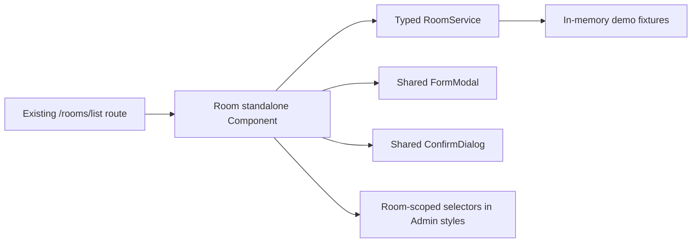
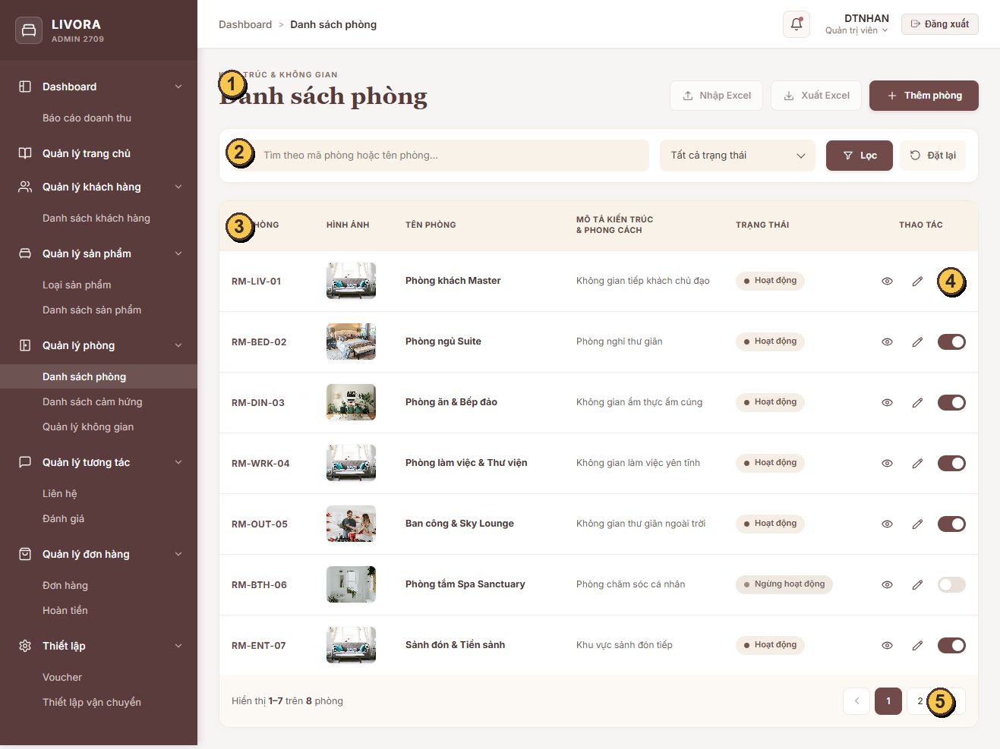
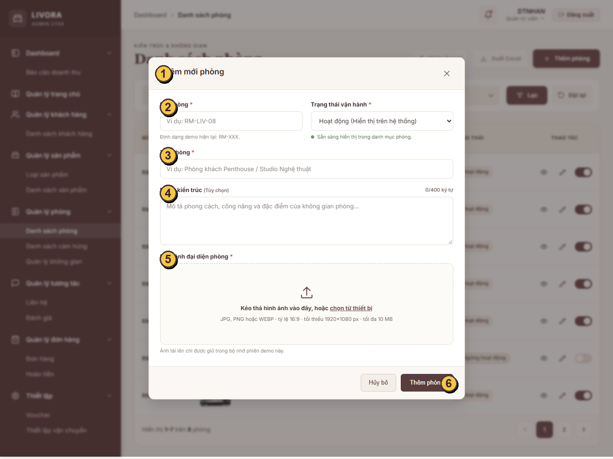
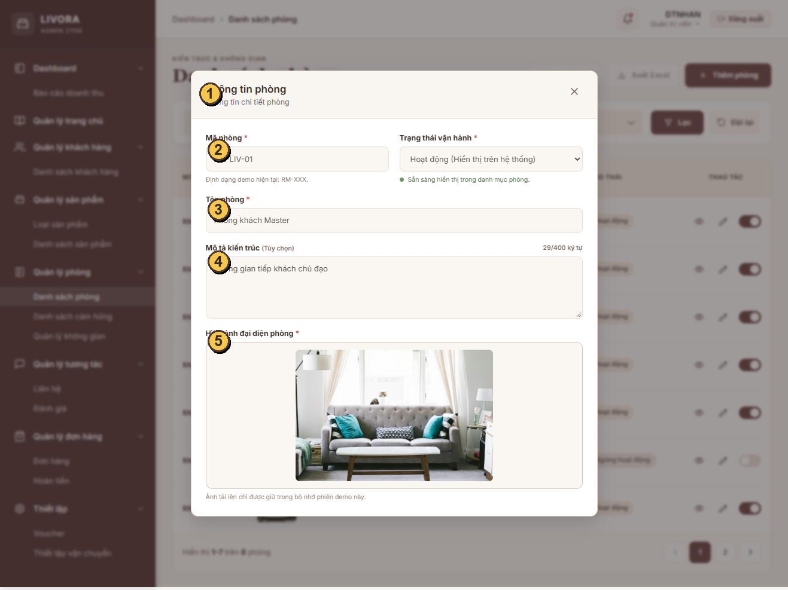
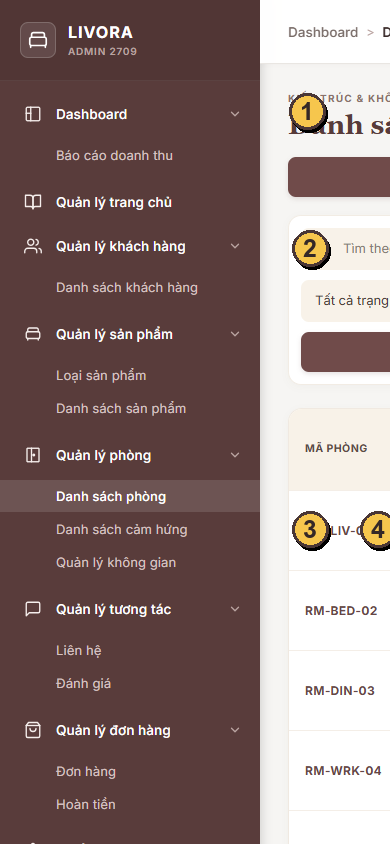
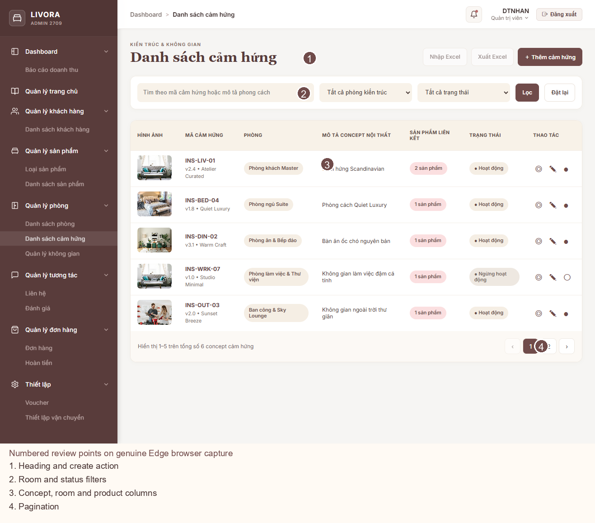
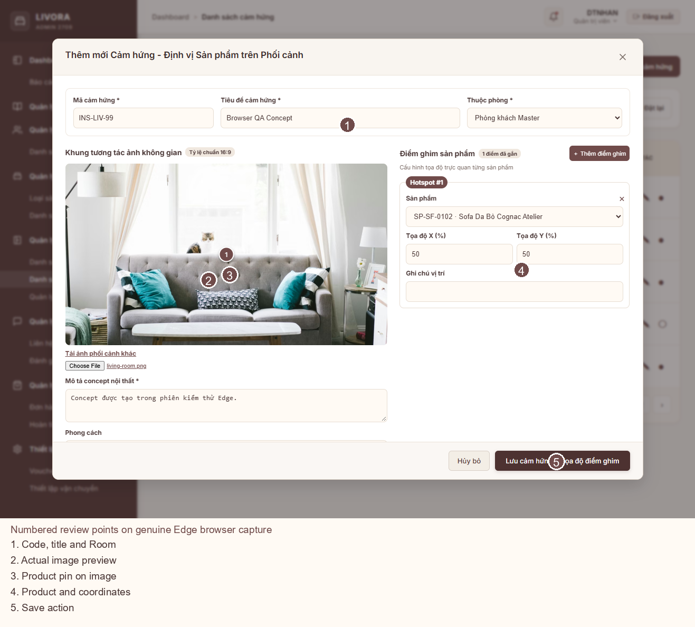
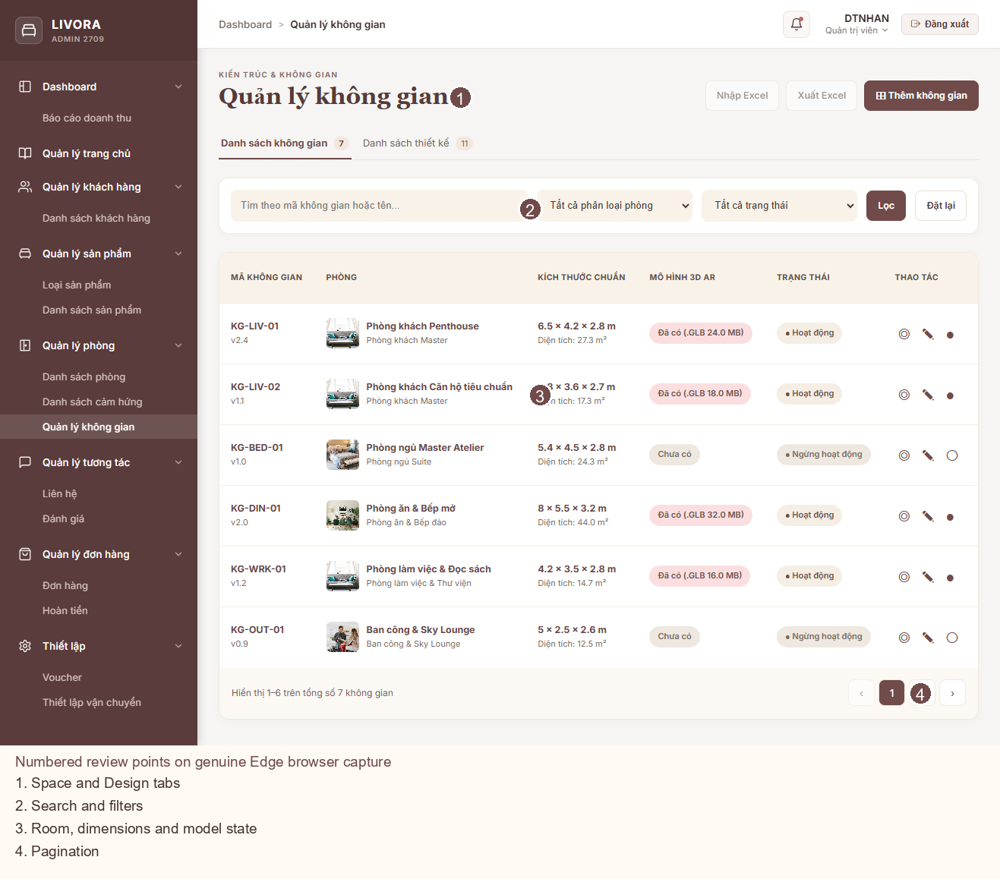
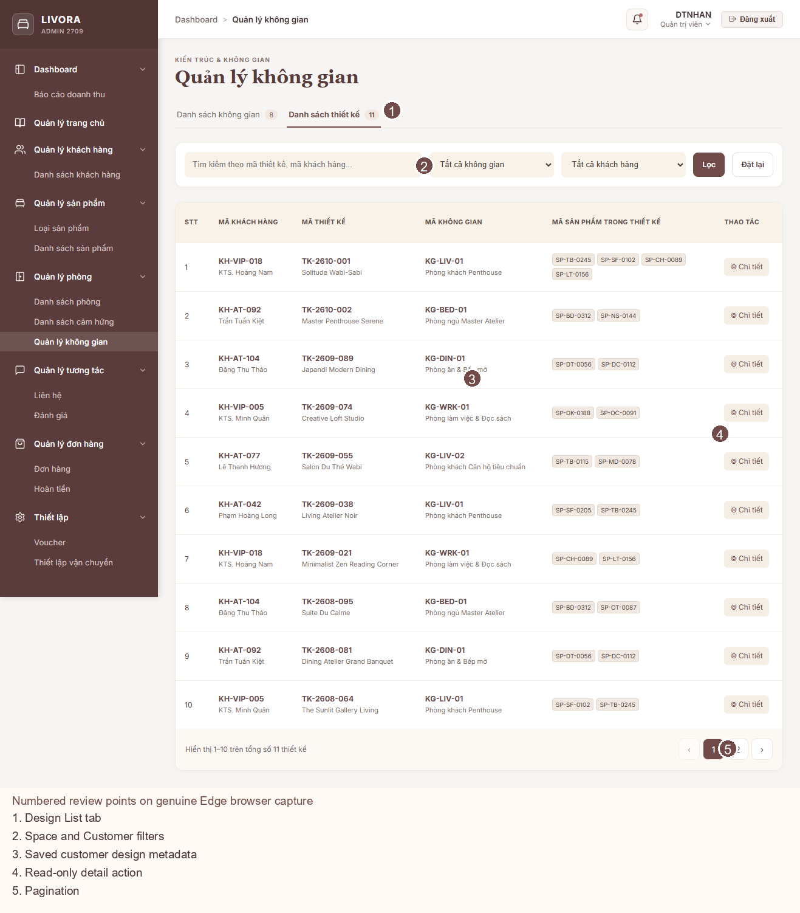
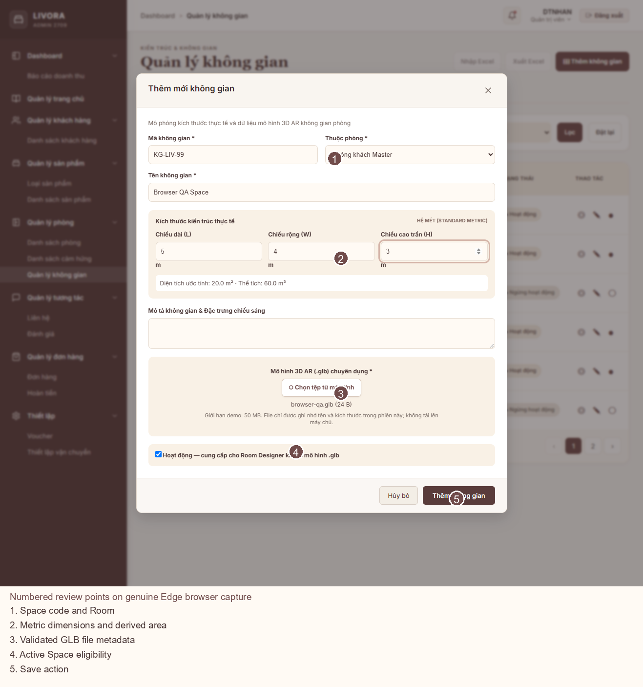

# LIVORA — Admin Room Management Implementation Report

**Status: IMPLEMENTED WITH LIMITATIONS**  
**Owner:** Tong Phuoc Hung  
**Routes:** `/rooms/list`, `/rooms/inspirations`, `/rooms/spaces`  
**Final verification date:** 2026-10-09 (Asia/Saigon; Room baseline verified 2026-10-08)

> **Scope correction:** The complete approved assignment includes Room, Inspiration, Space List, and the read-only Design List. Sections 1–18 preserve the prior verified Room QA pass and its historical results. Section 19 records the completed module extension and the final current verification. Earlier Room-only test counts and bundle measurements are retained as dated evidence, not the final whole-module totals.

## 1. Executive Summary

Implemented and verified the Admin Room list at `/rooms/list` using the existing Angular standalone app, route, shell, and shared modal/confirmation components. Edge browser QA passed list, create, edit-save, read-only view, case-insensitive search, active/inactive filtering, next/previous pagination, reactivation, required-image validation, and the referenced-Room deactivation guard. The browser recorded no page errors. Browser QA exposed an asynchronous image-preview rendering defect; a focused `ChangeDetectorRef.markForCheck()` fix now renders the selected image. Screenshot comparison also led to removing a Room-only demo banner and setting the Room modal width to match the 680 px Figma frame.

Room-specific tests pass (11/11). The full Admin suite has the same three failures at current HEAD and in an extracted clean `HEAD` baseline. Current: 20 files passed, 3 failed (48 passed, 3 failed); baseline: 19 files passed, 3 failed (38 passed, 3 failed). The ten additional passing tests are in the Room implementation. The production build has the same two CSS budget errors at current HEAD and baseline: `data-table.css` (9.15 kB) and `homepage.css` (27.35 kB), each against an 8 kB limit. The Room implementation also moves the initial bundle above its warning threshold: current 535.21 kB vs 500 kB, while baseline is 486.88 kB. No global budgets or unrelated components were changed.

Real Edge screenshots and annotated copies are included below. At 390 px, the existing Admin shell renders a 1,208 px document width with a fixed 260 px sidebar; the Room content is clipped until horizontally scrolled. This shell-level mobile limitation was recorded and left unchanged to preserve module scope. The implementation remains a session-only mock with unresolved backend contracts; this report does not claim production persistence or backend acceptance.

## 2. Module Scope

### Implemented

- Room list at existing `/rooms/list` route, inside the existing Admin shell and Sidebar.
- Search by Room code/name and filter by active/inactive status.
- Seven-row page with in-memory pagination and result counts.
- Create, edit, and read-only view modes.
- Required Room name and image, provisional code pattern, description length limit, and image MIME/size/dimensions/aspect-ratio validation.
- Status badges and confirmation before deactivation.
- Deactivation is blocked in the mock Service when its demo relationship snapshot includes Products or Inspirations.
- Loading skeleton, empty/no-result state, request-error/retry state, save feedback, validation/conflict feedback, and dirty-form close confirmation.
- Responsive CSS rules for compact viewports.

### Out of scope/not implemented

- Customer-side Room Designer, Product CRUD, and backend persistence.
- Excel import/export; the visible reference buttons remain disabled because no approved workflow/API contract exists.
- Backend persistence, real authentication/authorization, audit log, and real Room relationship lookup.
- Hard delete.

## 3. Reference Specifications

Business source: `artifact/REPORT.docx`, sections 3.2.2.6, 3.3.2.4–3.3.2.5, and Tables 19–22. All seven local Figma exports are copied into `artifact/reports/room-management/evidence/references/`. The first Room QA phase compared two references; the expanded comparison of the remaining five is in Section 19.

The business spec and visual reference conflict on Room code (`code` is required by the workflow and image but absent from the `Rooms` schema). The implementation uses a provisional Admin-only `code` in the mock model, normalized to uppercase and validated as `RM-...`. No DB/API field mapping is asserted. The reference's area column is omitted because the Room schema has no area/dimensions field.

## 4. Architecture Overview

The current Admin project contains no backend/API. `RoomService` provides typed list/create/update/status operations over a `BehaviorSubject` and demo fixtures; edits last only for the current app session. It is not database persistence. Feature CSS is imported by Admin `src/styles.css` and every rule is scoped beneath the `app-room` host, preserving feature isolation while avoiding the existing 8 kB per-component style budget.

## 5. Implemented Components and Files

| Path | Responsibility |
|---|---|
| `livora_admin/src/app/room_management/room/room.ts` | Page state, filters, pagination, forms, image validation, status flow, and feedback. |
| `livora_admin/src/app/room_management/room/room.html` | Room list, status controls, loading/empty/error states, and create/edit/view/confirmation UI. |
| `livora_admin/src/app/room_management/room/room.css` | Feature-scoped design and responsive rules, loaded through the Admin global stylesheet. |
| `livora_admin/src/app/room_management/room/room.model.ts` | Typed Room view model, query/result/draft types, and conflict errors. |
| `livora_admin/src/app/room_management/room/room.service.ts` | Session-only mock implementation and safe in-use status checks. |
| `livora_admin/src/app/room_management/room/room.spec.ts` | Component behavior tests. |
| `livora_admin/src/app/room_management/room/room.service.spec.ts` | Service pagination/search/uniqueness/reference tests. |
| `livora_admin/src/styles.css` | Imports Room CSS; Room selectors are scoped beneath `app-room`. |
| `livora_admin/public/images/rooms/` | Copies of existing local Customer room images used by the Admin demo fixtures. |

Shared `FormModal` and `ConfirmDialog` are reused. The feature implements its own table/filter/pagination markup to match the Room reference without changing shared component behavior.

## 6. Routes and Navigation

No route changes were needed. The existing `app.routes.ts` routes `/rooms/list`, `/rooms/inspirations`, and `/rooms/spaces` and their Sidebar entries are retained. Inspiration and Space placeholders were replaced in the expanded implementation recorded in Section 19.

## 7. Data Model and DTO Mapping

`Room` is an Admin view model with `id`, provisional `code`, `name`, `description`, `thumbnail`, `isActive`, and `displayOrder`. `RoomDraft`, `RoomListQuery`, and `RoomListResponse` are typed separately. Fixture relationship data is kept in a Service-private `RoomFixture` and is not returned in the Room list response.

The mock `code` must later be mapped to a backend-approved field or replaced with the agreed `slug` contract. Existing REPORT fields `thumbnail` and `isActive` are retained. No dimensions/area, version, or backend metadata is invented in the Room model.

## 8. Service and API Integration

No Room endpoint or backend is present. No endpoint has been invented. The mock Service supports list/search/filter/page, create, update, status changes, duplicate detection, and a demo-only dependency conflict. Local image selection produces a data URL in memory; it is not uploaded or persisted. A reload resets all changes.

## 9. Implemented Business Rules

- Room code is unique within the mock data and normalized to uppercase. Its canonical backend field/format remains unresolved.
- Room name is required.
- Description is optional and limited to 400 characters, following the create screenshot.
- Image selection accepts JPG/PNG/WEBP, up to 10 MB, minimum 1920 × 1080 pixels, and an approximately 16:9 ratio, following the screenshot guidance.
- Deactivation requires confirmation. The Service prevents deactivation when the demo fixture lists dependencies, including when status is changed through the edit flow.
- Reactivation is allowed. No hard deletion operation is exposed.
- The demo dependency snapshot is illustrative, not a live relationship query.

## 10. Form Validation and User Interactions

Search applies on Enter or the Filter button; status changes apply immediately; reset clears both filters. Pagination changes the displayed seven-row page. Create/update submits use a loading state and retain draft data after duplicate-code or in-use errors. Closing a changed form asks before discarding. Image validation checks type, size, resolution, and aspect ratio before storing a local preview.

## 11. Figma Design Comparison

The exported Room list and create-room frames were compared directly against the actual Edge screenshots at 1317 × 982. The implementation list structure, filters, table, status actions, and pagination align with the frame. Two Room-owned visual differences were verified and fixed: an extra session-data banner (removed) and an oversized create modal (constrained to 680 px). The create/edit modal title no longer adds an extra subtitle. The modal still reuses the existing shared `FormModal` component.

| Screen | Reference | Actual screenshot | Comparison and remaining difference |
|---|---|---|---|
| Room list | `reports/room-management/evidence/references/Danh sách phòng - LIVORA Admin.png` | `reports/room-management/evidence/implementation/room-list-1317x982.png` | **Compared.** Room-owned banner was removed. Existing Admin shell branding/top bar differs from the export and remains unchanged. Figma shows area/category subtext that is absent from the approved Room schema, so no such field is fabricated. |
| Create Room | `reports/room-management/evidence/references/popup thêm mới phòng.png` | `reports/room-management/evidence/implementation/room-create-1317x982.png` | **Compared.** Modal width now matches the 680 px frame; the field order, two-column first row, description, image target, and footer align. The shared modal has no frame icon slot. |
| Edit and view | No separate exported frame | `room-edit-1317x982.png`, `room-view-1317x982.png` | **Captured.** Edit uses the create layout; view uses the same shared modal as read-only details. |
| Mobile list | No mobile Figma frame | `room-mobile-390x844.png` | **Captured with limitation.** Existing shell document width is 1,208 px at a 390 px viewport because the 260 px sidebar remains fixed. Room content is clipped. Shell changes are outside this pass. |
| Mobile create | No mobile Figma frame | `room-create-mobile-390x844.png` | **Captured.** Modal adapts to viewport width; the existing shell remains horizontally overflowing. |

The Figma export shows active Excel actions, but import/export remains disabled because the approved workflow/API contract is absent. Demo fixture imagery is sourced from existing Customer assets; repeated fixture images do not exactly match all Figma photos. No screenshot-derived replacement images were fabricated.

### Annotated screenshots

The numbered markers identify: list (1) title/actions, (2) filters, (3) table, (4) row status/actions, (5) pagination; create (1) title, (2) code/status fields, (3) name, (4) description, (5) image upload, (6) footer; mobile (4) points to the clipped edge at the 390 px viewport.

## 12. Test Cases and Results

### Room-specific tests

Command: `npm test -- --watch=false --include=src/app/room_management/room/**/*.spec.ts` (from `livora_admin/`).

Result after the image-preview fix: **2 files passed; 11 tests passed.** Service coverage includes pagination/count, case-insensitive code search, status filtering, create/update and normalization, duplicate-code rejection, and in-use dependency checks. Component coverage includes code format and status labels. Browser QA additionally verifies the actual create/edit/view and filter/pagination flows.

### Full Admin suite and clean baseline reproduction

Command: `npm test -- --watch=false` (from `livora_admin/`). Current result: **20 files passed, 3 failed; 48 tests passed, 3 failed (51 total).** The same command was run against an extracted `HEAD` snapshot using the installed dependency tree; baseline result was **19 files passed, 3 failed; 38 tests passed, 3 failed (41 total)** with the same three failures. The count difference is ten passing Room tests added since baseline:

- `src/app/app.spec.ts`: “should render title” expects a `Hello` heading; the app renders no such heading.
- `src/app/sidebar/sidebar.spec.ts`: test setup has no `ActivatedRoute` provider.
- `src/app/homepage/homepage.spec.ts`: “hide” expects `Đã ẩn`, but `handleAction` leaves the row at `Đang hoạt động`.

This baseline replay establishes that all three failures existed before the Room changes. The three specs and their corresponding App, Sidebar, and Homepage implementation files are unchanged from `HEAD`. No unrelated test was altered.

### Browser interaction verification

Microsoft Edge was driven with cached Playwright 1.64.0 at 1317 × 982 and 390 × 844. `evidence/implementation/browser-interaction-results.json` records the run. It verified seven first-page rows; view; an edit saved and shown in the list; required-image validation; a create using a temporary 1920 × 1080 test image; case-insensitive search; inactive/no-result filtering; next and previous pages; reactivation of an unreferenced fixture; and a blocked deactivation for a referenced fixture. The browser reported no page errors. Test-created data exists only in the browser session and resets on reload.

## 13. Build Verification

| Command | Result |
|---|---|
| `npm run build -- --configuration development` | **Passed** after the final Room markup and scoped CSS alignment adjustments. |
| `npm run build` at current HEAD | **Failed** at unchanged component CSS budgets: `src/app/shared/data-table/data-table.css` 9.15 kB (8 kB limit; 1.16 kB over) and `src/app/homepage/homepage.css` 27.35 kB (8 kB limit; 19.35 kB over). |
| `ng build` from extracted `HEAD` | **Same two CSS budget errors** at the same measured sizes and limits. This confirms the CSS errors predate Room changes. |
| Current initial bundle | 535.21 kB combined, 35.21 kB above the existing 500 kB warning threshold. The extracted baseline is 486.88 kB, below the threshold; the Room implementation moves the initial app above the warning. |
| Lint | No lint script/configuration is defined in the Admin `package.json`; no lint command is available. |

The final global stylesheet is 15.10 kB (the extracted baseline was 0.45 kB). The production build also reports existing 4 kB style warnings for login, revenue, data-table, and homepage. The Room stylesheet is loaded through the global stylesheet, so it does not trigger the per-component style budget; this is not a reason to raise or bypass a budget. npm previously reported 5 dependency audit findings (3 high, 2 critical); no audit fix was run.

### Production budget findings and minimally invasive proposals

No global budget, `homepage.css`, `data-table.css`, or unrelated module was changed during this pass.

- `data-table.css` needs at least 1.16 kB removed. Its owning team can inspect its selectors against the shared table template, remove only proven-dead/duplicated rules, then rerun the production build and shared-table screens.
- `homepage.css` needs at least 19.35 kB removed. Because that is most of the file, a selector audit against Homepage templates followed by splitting genuinely separate Homepage sections into child components/styles is more credible than minification. Keep shared tokens in the existing theme and keep each component’s actual styles under the same 8 kB limit.
- The initial bundle warning is new relative to baseline. A targeted lazy load for the existing Room route is a candidate after the route owner reviews the current routing convention. This pass did not change route loading or the 500 kB budget.

These are proposals for the owning Admin team to review; they have not been implemented or used to change shared budgets.

## 14. Known Issues and Limitations

- All data is in-memory mock data; reload resets changes. No API/database persistence is implemented.
- The provisional `code` field and `RM-...` format need backend/team contract approval.
- Demo relationship snapshots exercise safe status handling but do not reflect live Product/Inspiration/RoomDesign usage.
- Excel import/export is not implemented; the visible reference buttons are disabled.
- At 390 px, the existing Admin shell produces a 1,208 px document width (260 px sidebar, 948 px main, 892 px Room host). The Room list is clipped at the viewport until horizontally scrolled. No shared-shell changes were made.
- Production CSS budgets remain exceeded in the unchanged Homepage and shared DataTable styles; the initial bundle is now over its warning threshold.
- The same three unrelated Admin test failures reproduce from clean `HEAD`.
- Room image fixtures use existing Customer assets and may repeat; they are not exact copies of all Figma photos.

## 15. Shared Integration Considerations

- Backend/API owner must decide whether Admin `code` maps to `slug` or a new `code` field and define unique-index/backfill behavior.
- Define the real Room status model and server response for dependency conflicts before replacing the mock Service.
- Confirm Room image storage, upload endpoint, and server-side validation. Current data URLs are for session demo only.
- Confirm whether referenced Rooms may be deactivated and which relationship types count as “in use.”
- Excel import/export requires a separate approved workflow and API contract.
- Existing Admin shell and three route definitions are retained. Inspiration and Space were added under the approved expanded module assignment.

## 16. Remaining Dependencies and Team Decisions

- Backend owner decision: whether Admin `code` maps to `slug` or a new field; unique-index/backfill rules; list/create/update/status API, error, paging, and permissions contract.
- Backend owner decision: Room image storage/upload endpoint and server-side validation.
- Product/domain owner decision: canonical hide/deactivate semantics and which live relationships block deactivation.
- Admin team owner review: minimally invasive CSS cleanup for the two existing component budget errors and a Room route lazy-load candidate for the new initial bundle warning.
- Admin shell owner decision: responsive navigation/content layout to resolve the measured 390 px horizontal overflow.
- Product owner/API decision: whether and how to enable the reference Excel import/export actions.

These decisions are not blockers to reviewing the session-only UI. They are blockers to production persistence, the listed build/test gates, or mobile shell acceptance.

## 17. Follow-up Work

- Replace the mock Service with the approved API implementation while retaining the typed Service boundary.
- Add browser automation to the repository only after the team approves a maintained test dependency; the current verification used a cached temporary runner.
- Ask the owning Admin team to address the production budgets and existing baseline test failures.
- Address shell-level responsive layout and decide on Excel workflows in their owning workstreams.

## 18. Final Acceptance Checklist

### Room scope

- [x] Existing `/rooms/list` route and Admin shell retained; no unrelated module refactor.
- [x] List, status filter, search, seven-row pagination, create, edit-save, read-only view, image validation, and status confirmation exercised in Edge.
- [x] Referenced-Room deactivation guard exercised; unreferenced fixture reactivation exercised.
- [x] Async image-preview defect fixed and reverified in Edge.
- [x] Visual comparison completed against both exported Room frames; verified Room-owned banner/modal-width differences corrected.
- [x] Actual and numbered annotated screenshots embedded in the Markdown report and DOCX.
- [x] Technical documentation remains English.

### Verification gates and limitations

- [x] Room tests pass (11/11).
- [x] Three full-suite failures independently replayed on clean `HEAD`; all are baseline failures.
- [x] Production CSS budget failures independently reproduced on clean `HEAD`; no global budgets changed.
- [ ] Full Admin suite passes — blocked by the same three baseline failures.
- [ ] Production build passes — blocked by unchanged Homepage/DataTable CSS budgets; current initial bundle also exceeds its warning threshold.
- [ ] Mobile list fits 390 px viewport — blocked by existing Admin shell horizontal overflow (document width 1,208 px).
- [ ] API, persistence, image upload, code/slug mapping, and live dependency behavior accepted — backend/domain decisions pending.

### Final handoff

- [x] `artifact/ROOM_MANAGEMENT_IMPLEMENTATION_REPORT.md` updated with evidence, findings, limitations, proposals, and this checklist.
- [x] `artifact/ROOM_MANAGEMENT_IMPLEMENTATION_REPORT.docx` generated from the complete Markdown report with genuine annotated browser screenshots. An isolated temporary Python 3.13 environment installed `python-docx` 1.2.0 without changing project dependencies; the finished DOCX re-opened successfully with 133 paragraphs, 3 tables, and 4 embedded annotated PNG images.
- [x] No commit or push created.

## 19. Complete Module Extension — Inspiration, Space, and Design List (verified 2026-10-09)

### 19.1 Executive summary and scope

The approved `room_management` assignment now covers all four Admin views and all seven exported Figma states. The verified Room implementation and its original QA evidence above were preserved. `/rooms/inspirations` replaces its placeholder with an Inspiration catalog and interactive hotspot editor. `/rooms/spaces` replaces its placeholder with a Space List and a read-only Design List tab. No route, sidebar, Product Management, Customer frontend, Homepage, shared DataTable, or global CSS budget was changed. Every new record mutation is session-only and resets on reload.

### 19.2 Architecture, components, and routes

| Existing route | Page and service boundary | Delivered view |
|---|---|---|
| `/rooms/list` | `room/room.ts`, `RoomService`, `RoomUsageService` | Existing Room list and create/edit/view flow; newly created Inspiration/Space records now register a session dependency before Room deactivation. |
| `/rooms/inspirations` | `inspiration/inspiration.ts`, `InspirationService`, `EligibleProductService` | Inspiration list, create/edit/view, linked Product hotspots, hide/show confirmation. |
| `/rooms/spaces` | `space/space.ts`, `SpaceService`, `DesignService` | Space List tab and Design List tab; no new Sidebar entry. |

The feature-local types are `Room`, `InspirationRecord`, `Hotspot`, `SpaceRecord`, and `DesignRecord`. The shared `FormModal` and `ConfirmDialog` remain in use. New `catalog.css` is imported from Admin `styles.css` and scoped to `app-inspiration` and `app-space`; existing Room selectors stay under `app-room`. The file picker and actual browser screenshots are in `reports/room-management/evidence/implementation/`. No backend endpoint or database table/collection was invented.

### 19.3 Domain relationships and provisional contracts

- A Room is a category. An Inspiration is editorial content with exactly one `roomId` and zero or more Product hotspots; one Product may appear in many Inspirations. A Space is an individual 3D template associated with one Room. A saved Design is a customer-created RoomDesign associated with one Space and Room and shown only for inspection.
- `REPORT.docx` Table 20 supports Inspiration `title`, `slug`, `roomId`, `style`, `thumbnail`, `content`, `taggedProducts` with `productId/xPercent/yPercent`, `viewsCount`, and `published`/`hidden` status. The `INS-...` business code, version, and pin note visible in Figma are **provisional mock/UI fields**; they are not asserted as database fields.
- `REPORT.docx` Table 21 describes `RoomDesigns` with `customerId`, `roomId`, `name`, `file3DUrl`, `previewImage`, `layoutData`, `suggestedProducts`, `isTemplate`, and `createdAt`. The Space list projects template records; the Design List projects customer records. `KG-...` code, metric dimensions, version, status, and direct customer-design `spaceId` are **provisional UI fields** until an API owner reconciles the template/design relationship and migration.
- The new `RoomUsageService` records Inspiration and Space relationships created or edited in the current session. `RoomService` combines these with its preserved fixture reference snapshot when blocking deactivation. Historical fixture references are illustrative; they are not a live scan of existing Product, Inspiration, Space, or customer Design data. Backend dependency checks remain mandatory before production use.

### 19.4 Services, business rules, and validation

`InspirationService` provides typed list/search/Room/status/page, create/update, and status operations over in-memory records. Codes are normalized and unique within the mock. Save requires title, content, image, and an active existing Room. Every selected hotspot Product must exist, be eligible for sale, and belong to the selected Room. X/Y coordinates must be finite percentages between 0 and 100. Image selection accepts JPG/PNG/WEBP up to 10 MB and produces a local preview; it is never uploaded. The mock blocks hiding its referenced `INS-LIV-01` fixture and shows an error without changing status. No hard delete is exposed.

`SpaceService` provides typed list/search/Room/status/page, create/update, and active-state operations. Save requires a unique provisional `KG-...` code, name, active existing Room, positive finite length/width/height up to 100 **metres**, and a `.glb` selection. Area (`m²`) and volume (`m³`) are derived from those inputs. The browser file picker checks `.glb`, a provisional demo size cap of 50 MB, the `glTF` magic, GLB version 2, and the header-declared byte length. The mock stores **only file name and byte count**; it does not upload or persist model bytes. An existing Space without a model cannot become active. Space deactivation does not delete linked customer Designs. No Space delete is exposed.

`DesignService` returns read-only mock customer designs. Search covers design/customer identifiers and names; Space/Customer filters, ten-row paging, and a detail modal are available. No design create, edit, delete, or publish action was invented. Product and Customer references here are representative projection data, not connected to real Product or Customer APIs. All service errors keep form data for correction or retry; list loading, empty/no-result, error/retry, success, and confirmation states are present.

### 19.5 UI and Figma comparison — all seven references

The exported frames and actual captures were inspected at comparable desktop widths. Local shell branding, top bar, font assets, and fixture photography differ from the exports; those belong to shared Admin/data ownership and were not changed. Screenshot file names below refer to `reports/room-management/evidence/`. Numbered annotated actual captures are embedded after this table.

| Exported Figma frame in `references/` | Actual Edge capture in `implementation/` | Verified comparison |
|---|---|---|
| `Danh sách phòng - LIVORA Admin.png` | `room-list-1317x982.png` | Prior Room QA compared the frame; its extra demo banner was removed. Area/category subtext has no Room schema source. |
| `popup thêm mới phòng.png` | `room-create-1317x982.png` | Prior Room QA compared the frame and corrected modal width to 680 px. |
| `Danh sách cảm hứng - LIVORA Admin.png` | `inspiration-list-1317x982.png` | Heading, search, Room/status controls, concept/Room/Product/status columns, actions, and pagination are present. Fixture counts and images are representative rather than Figma data. |
| `popup thêm mới cảm hứng.png` | `inspiration-create-populated-1317x982.png` | Wide two-column editor, image preview, numbered hotspot, Product selector, X/Y inputs, visibility, and save footer are present. The exported Product detail card/price and three prefilled pins are not reproduced; the actual new form starts empty and the evidence shows a single pin entered in Edge. A stale required-fields banner found in the first capture was fixed and the final capture rechecked. |
| `Quản lý không gian - Danh sách không gian - LIVORA Admin.png` | `space-list-1317x982.png` | Space/Design tabs, Room image/name, metric dimensions, GLB state, status, actions, and paging are present. A transient “Room missing” label seen before Room lookup loaded was fixed. |
| `Quản lý không gian - Danh sách thiết kế - LIVORA Admin.png` | `design-list-1317x982.png` | Read-only customer/design/Space/Product columns, filters, details, and paging are present. A stale Space success notice and a native-looking Detail button were corrected. Figma's “real-time synchronized” indicator is omitted because no backend sync exists. |
| `popup thêm mới không gian.png` | `space-create-populated-1317x1200.png` | Code, Room, metric dimensions/derived values, description, selected GLB metadata, active state, and footer are visible. The form includes `name` from Table 21 and has a simpler file area than Figma. GLB selection is session-only; the final capture uses a valid minimal 24-byte GLB for QA. |

### 19.6 Automated, browser, and responsive verification

The final focused command `npm test -- --watch=false --include=src/app/room_management/**/*.spec.ts` passed **6 files and 28/28 tests**. This includes the original **11 Room tests** plus Inspiration, Space, Design List, form/modal, validation, search/filter/page, status, and newly created cross-domain Room dependency checks. The final Admin development build, `npm run build -- --configuration development`, passed.

Microsoft Edge, driven by cached Playwright 1.64.0, completed **24/24 scripted checks with zero page errors**. The script and machine-readable result are `module-browser-qa.js` and `module-browser-interaction-results.json`. It exercised route loading; Inspiration modal/required fields/image preview/create/search/view/edit/page; Space modal/required fields/invalid GLB header rejection/valid GLB/create/search/view/edit; Design tab/list/detail/search/page; and Room route regression. The actual browser captures above were taken during those flows. Room create/edit/status and image validation remain covered by the preserved earlier Room browser QA.

At 390 × 844, both new form modals fit within the viewport and scroll internally. The actual Inspiration, Space, and Design mobile captures are included in the evidence folder. The existing Admin shell still produces a **1,228 px document width** at a 390 px viewport during the final Design capture, so list content clips horizontally. The prior Room capture measured 1,208 px. No shared shell refactor was made in this feature pass.

### 19.7 Full-suite and production build status

The final full Admin suite passed **63 tests and failed 3** across **22 passing and 3 failing files**. All three failures are the same untouched App (`Hello` heading expectation), Sidebar (missing `ActivatedRoute` test provider), and Homepage (hide-status expectation) failures independently reproduced from a clean extracted HEAD during the Room QA pass. No new module test failed. The earlier clean HEAD result was 38 passing/3 failing tests; the final module adds 25 passing tests relative to that baseline.

The final production build still fails only at the two existing component CSS budgets: shared DataTable **9.15 kB vs 8 kB** and Homepage **27.35 kB vs 8 kB**. These exact sizes and errors were reproduced on clean HEAD during the earlier Room QA pass. No budget was raised and neither owning CSS file was edited. The final initial bundle is **618.58 kB vs the existing 500 kB warning budget** (118.58 kB over); it grew from the Room-only 535.21 kB and clean HEAD 486.88 kB. A route-loading review and owner-led CSS reduction remain sensible proposals; they were not silently applied to shared routing or unrelated modules.

The complete DOCX was regenerated with `python-docx` 1.2.0 in an isolated Python 3.13 environment and reopened successfully. It contains **nine genuine annotated Edge images** (four preserved Room captures and five new captures). Installed Word exported a PDF preview; the title, new image pages, and final checklist page were rendered and inspected. PDF and selected page previews are retained under `reports/room-management/` as document QA evidence. No Python package was installed into the Angular project or globally.

### 19.8 Known limitations, integration dependencies, and architecture decisions

- Session-only mock records, thumbnails, status changes, Product eligibility, and customer designs reset on reload and are not production data. A browser-selected image becomes a local data URL; a selected GLB contributes validated metadata only. No real asset upload, persistence, 3D rendering, or sync exists.
- `code` versus `slug`, Inspiration version/pin note, Space code/version/dimensions/status, saved-design `spaceId`, file size/storage/security rules, and API list/error/permission contracts need the backend/domain owners' decision. The original `REPORT.docx` was not modified.
- Real reference checks must be server enforced. The new session dependency ledger covers records saved during this session; preserved initial Room fixture references are snapshots and do not enumerate all existing designs/products. Product saleability is a separate mock catalog because the Product module has no approved lookup API.
- Excel actions remain disabled. The Design List has no mutation. Figma fixture counts (24 Inspirations, 18 Spaces, 64 Designs) are not claimed: the session fixtures contain 6, 7, and 11 respectively before browser-created records.
- The Inspiration Product card is simpler than Figma and the Space modal's file area is simplified. The Admin shell mobile overflow and shared branding differences remain for their owning team. Full Admin tests and production build are not green for the evidenced baseline reasons above.

### 19.9 Final acceptance checklist

- [x] Existing verified Room page and its QA files preserved; Room regression tests pass.
- [x] `/rooms/inspirations` has functional list, search, Room/status filters, pagination, create/edit/view, image preview, Product hotspots, validation, and status guard.
- [x] `/rooms/spaces` has functional Space List and read-only Design List tabs, search/filter/page/detail, metric Space form, GLB validation, and status guard.
- [x] All three existing routes and three creation modals are present; Admin development build passes.
- [x] 28/28 focused tests and 24/24 Edge checks pass; no browser page errors.
- [x] All seven exported Figma frames are referenced; seven corresponding real desktop captures and numbered annotated captures are preserved in evidence.
- [x] Browser-observed stale form notice, transient Room label, stale tab notice, and Detail-button visual issues corrected and recaptured.
- [x] Markdown and DOCX reports include the expanded module, original Room QA, and genuine annotated browser screenshots.
- [x] No commit or push created.
- [ ] Full Admin suite passes: three independently established HEAD-baseline failures remain in unrelated App, Sidebar, and Homepage specs.
- [ ] Production build passes: unchanged Homepage/DataTable component CSS budgets remain exceeded; initial bundle warning is larger and needs review.
- [ ] 390 px Admin lists fit the viewport: fixed shared shell/sidebar overflow remains.
- [ ] Backend persistence, real upload, live Product/Customer lookups, permissions, and provisional field contracts are approved and integrated.
