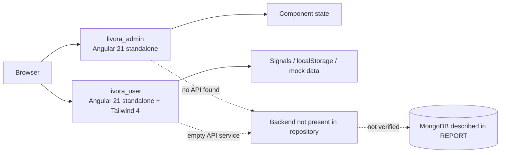
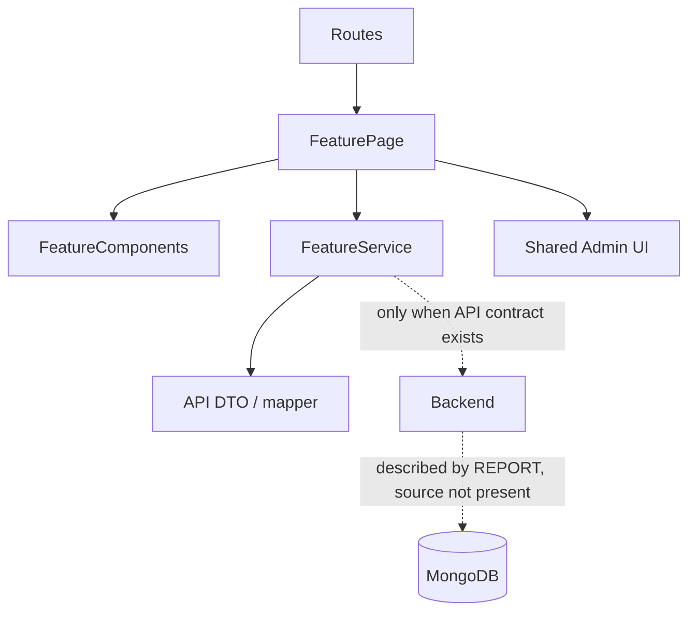
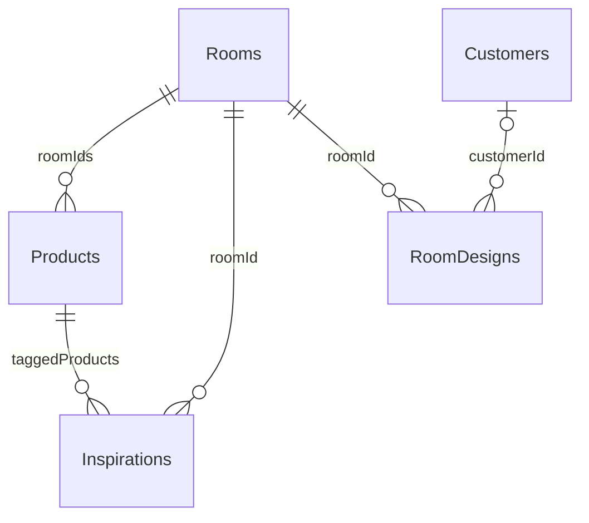

# LIVORA — System Design and Engineering Standards

> **Status:** Team-approved architecture; implementation authorized by the current `APPROVED IMPLEMENTATION` brief.  
> **Audit scope:** Source code in `livora_admin/`, `livora_user/`, `artifact/REPORT.docx`, and the seven images in `artifact/design-reference/room-management/`.  
> **Reading guide:** “Current state” describes evidence in the repository or specification; “Proposal” describes recommendations requiring team approval. No backend or running API has been verified in this repository.

## 1. Project Overview and Technology Stack

LIVORA is an interior e-commerce project composed of two independent Angular applications in a single Git repository: an administration application and a customer website. `REPORT.docx` describes a system using MongoDB and e-commerce workflows. The repository currently contains no backend application, database connection configuration, migrations, API specification, or corresponding deployment environment.

| Area | Observed current state |
|---|---|
| Frontend | Angular 21, standalone components, TypeScript 5.9, RxJS 7.8; each application has separate Angular CLI configuration. |
| Admin | `livora_admin`; plain CSS; components and routes are currently loaded directly. |
| Customer | `livora_user`; Tailwind CSS 4 via PostCSS, component CSS, and some inline styles. |
| Forms | Angular Forms are dependencies of both applications; Admin has basic shared form/modal components. |
| State | No shared store library found. Customer has some Angular signals and `localStorage`; Admin mostly uses component properties. |
| API/backend | No backend or API contract is present in the repository. `livora_user/src/app/services/api.ts` currently declares an empty service. |
| Database | `REPORT.docx` proposes MongoDB and collections; this is a specification, not a verified integration in source. |
| Build/test | Both `package.json` files declare `ng build` and `ng test`; they were not run during the audit because the required workflow stops before implementation. |
| Versions | Admin declares Angular CLI `^21.2.9`, user declares `^21.2.14`; both declare Angular core `^21.2.0`. Package managers are npm 11.12.1 and npm 10.8.2, respectively. |

## 2. As-Is System Architecture



### Angular configuration and structure

- The two applications have separate `angular.json`, `package.json`, `package-lock.json`, `src/main.ts`, `app.config.ts`, `app.routes.ts`, and styles. They are two CLI applications, not a single Angular workspace configured at the repository root.
- Both bootstrap as standalone applications through `bootstrapApplication`. No `NgModule` architecture was found.
- Routes in both applications import components directly; lazy loading is not currently used. Admin routes are in `livora_admin/src/app/app.routes.ts`; customer routes are in `livora_user/src/app/app.routes.ts`.
- Admin has `app/room_management/{room,inspiration,space}`. Room is implemented with a typed session-only service; Inspiration and Space were placeholders at the original audit snapshot. The approved 2026-10-08 scope correction covers their implementation and the Design List inside the Space route.
- Customer has room/product browsing pages and a sample Room Designer. Much product data is embedded directly in components. `module-4` demonstrates a planner with DOM/CSS; it does not verify integration with a 3D/AI engine.
- Shared Admin UI currently includes `DataTable`, `FilterBar`, `FormModal`, `ConfirmDialog`, and `Pagination` under `livora_admin/src/app/shared/`. `DataTable` supports sorting, pagination, selection, badges, actions, and cell templates; Room does not currently use these components.
- `Sidebar` and the Admin layout in `app.html` are shared across routes. There is no shared package or workspace between Admin and Customer.

### API, state, security, and integration

- No backend project, endpoint inventory, HTTP interceptor, API URL environment, database driver/schema code, Docker/service configuration, or related `.env` example was found.
- Admin login currently navigates directly to the dashboard in `login.ts` without checking credentials. The logout button in `app.ts` only navigates to `/login`. Admin routes have no authentication or permission guard.
- Customer has a hard-coded demo `AuthService`, stores a profile in `localStorage`, and has an `authGuard` protecting only the profile route. This is a client-side mock flow, not server authentication.
- The Customer cart is stored in `localStorage`. The `Api` service is currently empty; the room product page contains inline mock data. The original audit found no Room/Inspiration/Space CRUD or API pagination; the current Admin module now has session-only CRUD and local pagination, with no API synchronization.
- No working module-permission management was found, despite `REPORT.docx` describing employee roles and access rights.

### Build, test, and configuration

- Each app defines `start`, `build`, `watch`, and `test` scripts. `angular.json` uses `@angular/build:application` and `@angular/build:unit-test`.
- Both apps contain `*.spec.ts` files, but many are scaffold specs and do not demonstrate business behavior. Build/tests were not run during this audit.
- No Angular environment files were found in the inspected paths. Admin `angular.json` references only `src/styles.css`; Customer enables Tailwind through `@import "tailwindcss"` in `src/styles.css`.
- No backend build/test scripts or deployment configuration were found at the root.

## 3. Proposed Architecture and Rationale

Keep the two existing Angular applications independent and retain each application's existing styling approach; extend the current feature structure. Do not migrate to a new architecture or merge the frontends before the team agrees on deployment, package sharing, and ownership.

1. Feature owners keep code within their feature. Routes should navigate to page containers. Prefer standalone components with explicit imports.
2. Use Admin `shared/` for genuinely reusable UI. Keep business models and services in the corresponding feature/core area. Do not place Room DTOs in `DataTable` or global shared code merely because the table needs to display them.
3. Put API types in an approved contract; use a mapper at the service boundary when DTO terminology differs from UI terminology. Prefer `unknown` or concrete types over `any` in new contracts.
4. Integrate a real API only when the backend owner provides a contract and environment. Until then, if approved, mocks must sit behind a typed service and be marked as demos; do not present them as real endpoints.
5. Review changes to `SYSTEM_DESIGN.md` and shared models/styles across the team. Do not implement a module until explicit approval is received.

### Proposed dependency diagram



## 4. Proposed Directory Structure

This is a target structure based on the existing applications, not the current directory tree. Extend `livora_admin/src/app/`; do not move existing files unless necessary.

```text
livora_admin/src/app/
  core/                 # shared app-wide auth, guards, interceptors, configuration
  layouts/              # Admin shell/header if separated from the current app
  shared/               # reusable UI; no feature-specific business rules
  room_management/
    room/                # page, form, models, service (after contract approval)
    inspiration/          # related feature/owner
    space/                # related feature/owner
  product_management/
  order_management/
  ...
```

Retain the current Angular CLI file convention (`room.ts`, `room.html`, `room.css`) until the team agrees to migrate to `.component.ts` suffixes. A feature may use `models/`, `services/`, `pages/`, and `components/` when it has enough files; avoid empty layers added only to match a template. Do not migrate Admin to SCSS while it uses plain CSS. Avoid direct source references from one application to the other.

## 5. Module Boundaries and Ownership

| Boundary | Proposed owner | Integration notes |
|---|---|---|
| `livora_admin/src/app/room_management/room/` | Tong Phuoc Hung (expanded assignment) | Existing verified Admin Room feature; preserve its behavior. |
| `room_management/inspiration/` | Tong Phuoc Hung (2026-10-08 scope correction) | Inspiration catalog and mock Product/Room references; production field and API changes need coordination. |
| `room_management/space/` | Tong Phuoc Hung (2026-10-08 scope correction) | Space templates and read-only customer Design List; 3D upload and API contract need a backend owner. |
| `product_management/` | Product feature owner | Supplies product lookup/status contract for Inspiration and RoomDesign. |
| `livora_user/` | Customer frontend team | Consumes public Room/Inspiration/RoomDesign data; field names must match Admin/backend contracts. |
| `shared/`, `core/`, `app.routes.ts`, `src/styles.css` | Team agreement; appoint a maintainer | Cross-review any change affecting shared code. |
| Backend/API/DB | Not identified in the repository | The team must appoint an owner and agree on the contract before real integration. |

Owners other than Hung are unknown; this table does not imply that team assignments have been made.

## 6. Data Architecture and Entity Relationships

`REPORT.docx`, sections 3.4.1–3.4.2 (Tables 15, 19, 21, and 22), describes MongoDB collections. The repository has no corresponding runtime schema definitions.



| Canonical entity | Collection name in REPORT | Described fields | Main relationships |
|---|---|---|---|
| Room | `Rooms` | `_id`, `name`, `slug`, `description`, `thumbnail`, `displayOrder`, `isActive` | Many Products through `roomIds`; Inspirations/RoomDesigns through `roomId`. |
| Product | `Products` | `_id`, `sku`, `name`, `categoryId`, `roomIds`, price, stock, images, `status`, and other attributes | References Category/Rooms; tagged by Inspiration. |
| Inspiration | `Inspirations` | `_id`, `title`, `slug`, `roomId`, `style`, `thumbnail`, `content`, `taggedProducts`, `viewsCount`, `status` | One Room; many Products through `taggedProducts`. |
| RoomDesign | `RoomDesigns` | `_id`, `customerId`, `roomId`, `name`, `file3DUrl`, `previewImage`, `layoutData`, `suggestedProducts`, `isTemplate`, `createdAt` | Room; optional Customer; suggested Products. |

### Proposed data conventions

- Use `Room`, `Product`, `Inspiration`, and `RoomDesign` as entity names in code; retain PascalCase plural collection names from REPORT.
- TypeScript uses `interface Room` and camelCase matching existing fields (`roomId`, `isActive`, `displayOrder`). Do not independently rename `isActive` to `status` or vice versa across frontend/backend.
- Keep `Room`/`Inspiration`/`RoomDesign` domain models separate from `CreateRoomRequest`, `UpdateRoomRequest`, or `RoomListItem` if the API contract differs. Represent IDs according to the API contract (MongoDB ObjectId serialized as a string) and use an explicit mapper.
- Use `thumbnail` as the canonical image field, following the existing schema. The UI label “Hình ảnh đại diện” means “Representative image” and may map to `thumbnail`; do not introduce `image`, `imageUrl`, and `coverImage` simultaneously without a contract.
- REPORT calls hotspot coordinates `xPercent`/`yPercent`; confirm the 0–100 range and exact round-trip behavior with the UI before implementation.

## 7. Frontend/Backend API Conventions

**Current state:** No endpoint or API schema was found. The route shapes below are suggestions about behavior/contracts, not existing URLs.

- Each Service returns typed DTOs/responses and encapsulates requests; Components control UI and do not construct URLs/fetch calls themselves.
- For large lists, the team should select one consistent pagination response (for example, `items`, `page`, `pageSize`, `totalItems`, `totalPages`) and define search/status/sort encoding. Server-side pagination should be the source of truth; `DataTable` can accept `totalPages`/`totalItems` but does not define a server contract.
- Client validation improves data entry; the backend must still validate unique code/slug, Room/Product relationships, permissions, file size, and record state.
- Services distinguish validation errors (field errors), conflict (duplicate code/reference), unauthorized/forbidden, not found, and network/server errors. The UI retains user input when saving fails.
- Loading, empty, error/retry, and success are separate states. Do not treat an empty list caused by an error as a normal empty state.
- Auth token/cookie, CSRF/CORS, upload URL, permissions, file storage, and API version are not defined. Do not store credentials in localStorage or rely on client guards as a security boundary.
- Use mocks only behind an approved Service interface for demos; keep fixtures separate and do not claim they are a real backend.

## 8. Shared UI Design System

### Current state

- Admin global CSS has a reset and Inter font stack; the layout background is `#f7f6f4`. The sidebar uses dark brown near `#593c3b`. Each Component has its own CSS; no centralized color/spacing/type scale tokens were found.
- Customer defines `--font-heading: 'Playfair Display'` and `--font-body: 'Inter'` and uses Tailwind 4; these styles are specific to the Customer app and are not automatically shared with Admin.
- Admin has `DataTable`, `FilterBar`, `FormModal`, `ConfirmDialog`, and `Pagination`; Room does not yet reuse them. Some widgets expose generic status/action options for both “hide” and “delete,” so each feature must configure the correct semantics.
- Code references `bi bi-*` classes, but `bootstrap`/`bootstrap-icons` are not dependencies of Admin or Customer. Sidebar uses inline SVG; no loaded icon font was verified.

### Proposal

| Token/group | Proposed convention requiring approval |
|---|---|
| Color | Move existing brand colors into Admin CSS custom properties; use existing shared Admin styles before adding colors. Do not copy the entire Figma palette into global CSS before review. |
| Typography | Inter for content/controls; serif headings only where needed to match Figma. Confirm font files/imports and fallbacks. |
| Spacing/radius | Agree on a small scale and shared radii after comparing current Admin styles with references; feature CSS should use tokens rather than arbitrary values. |
| Buttons/forms/modal | Reuse shared modal/dialog when suitable; check focus, keyboard access, required labels, inline errors, and disabled/loading states. |
| Table/badge | Use `DataTable`/`Pagination` when semantics fit; a “hide” action needs a label/confirmation and must not silently use a “delete” action. |
| Icon | Choose an explicitly installed source: continue with inline SVG or approve a library. Do not depend on `bi-*` without configured stylesheets. |
| Breakpoints | No standard is documented in the repository; the team must agree on desktop/tablet/mobile breakpoints before responsive acceptance. |
| States | Every data page needs loading, empty, error/retry, and success states; images need alt text/fallbacks. |

Global styles should change only through shared review; Room-specific styles belong in `room.css` or the relevant feature file. Do not use Tailwind in Admin without an installation/configuration decision.

## 9. Naming Conventions

| Area | Proposed convention |
|---|---|
| Component/class | PascalCase (for example, `RoomListPage` if the team approves the specific name); retain current file convention until migration. |
| Member/function | camelCase; use `on...` event handlers where consistent with the event convention; Service methods describe actions (`listRooms`, `createRoom`). |
| Type/interface | PascalCase, domain noun (`Room`, `RoomStatus`); do not use an `I` prefix. |
| API/database field | camelCase as in REPORT (`roomId`, `thumbnail`, `isActive`). MongoDB collections use plural PascalCase. |
| CSS | kebab-case classes, with a feature prefix if collision risk exists. Prefer Component-scoped CSS. |
| Route | Existing English, lowercase, kebab-case or plural nouns (`/rooms/list`); do not change a route consumed by Sidebar/Customer without review. |
| Boolean/status | Use `isActive` for a boolean as in the current DB proposal. Do not use a string `status` as a boolean; agree on a separate enum if multiple states are required. |

## 10. Routing and Component Reuse Strategy

- Keep the current public routes, including Admin `/rooms/list`, `/rooms/inspirations`, and `/rooms/spaces`; Sidebar and route titles in `app.ts` also depend on these URLs.
- Admin currently loads Components directly without lazy loading. Retain this pattern for a small near-term change; lazy loading is a shared architecture/performance decision that needs review and measurement.
- `App` is the Admin shell: login renders outside the shell; other routes render inside the sidebar/topbar. There is no guarded parent route currently.
- Reuse shared `DataTable`, `FilterBar`, `FormModal`, `ConfirmDialog`, and `Pagination` when their inputs/keyboard/layout fit. Do not duplicate shared logic or change shared component semantics to serve only one screen.
- Inspiration and Space have existing routes; the Design List is a tab within `/rooms/spaces`. These are distinct domains inside the same approved Admin assignment and share Room lookup through the typed Room service boundary.

## 11. Authentication and Access Control

**Current state:** Backend authentication has not been found. Customer demo authentication uses `localStorage`; Admin login is bypassed; Admin routes are not guarded. `REPORT.docx` sections 3.2.2 and 3.4.2.2 describe Super Admin, Content Admin, Operations Admin, Customer Service Admin, and Accountant roles with permissions.

**Proposal:** Backend authentication and authorization are authoritative. Frontend guards serve UX only. Room CRUD/hide/restore should use the role policy agreed by the team (likely Super Admin and Content Admin according to REPORT; confirmation is needed). Audit fields for the editor/status are absent from the Room schema and need a decision if required.

## 12. Error Handling and State Management

- Do not add a new store until a demonstrated need exists. For a small list/form, feature-local state or signals/Observables following the feature's pattern is sufficient if used consistently.
- A Service should emit typed errors or centrally map `HttpErrorResponse` once HTTP is configured; the UI should show actionable messages and retain drafts after save errors.
- Disable submit during save, prevent double submission, reset page to 1 when filters change, and confirm before closing a dirty form; these UI policies should be standardized.
- Losing permission/401 is distinct from a server error; do not fabricate successful data when a request fails.

## 13. Team Collaboration and Integration Guidelines

1. Each developer works on a personal branch following the root `README.md`; do not commit, push, or merge directly to `main`.
2. Feature owners limit changes to their feature folder. Avoid simultaneous edits to `app.routes.ts`, shell/Sidebar, shared UI, global styles, or common DTOs without coordination.
3. Before changing a contract, open a note/PR describing fields, nullability, enums, example request/response, consuming owners, and migration/backward compatibility; get confirmation from other frontend/backend owners.
4. Appoint maintainers for `shared/`, `core/`, `SYSTEM_DESIGN.md`, API types, and styles. Change a shared Component only after checking its consumers.
5. Proposed integration checkpoints: (a) entity/API contract; (b) shared UI/tokens; (c) feature route merge; (d) build both apps and cross-check routes; (e) approve screenshot/Figma comparison.
6. Keep branches short, update from the team branch using the team's chosen method, and resolve conflicts with owners; do not remove another developer's changes unilaterally.
7. Mark something “verified” only when the corresponding build/test/interaction actually ran.

## 14. Existing Inconsistencies and Proposed Resolutions

| Conflict/gap | Evidence | Proposal for team review |
|---|---|---|
| Room code is required but missing from the schema | BPMN 3.3.2.4 requires a unique room code; the create-room screenshot has “Mã phòng” (“Room code”); `Rooms` Table 19 has only `_id`, `name`, `slug`, `description`, `thumbnail`, `displayOrder`, and `isActive`. | Add a unique `code` to the contract/DB or confirm that the displayed code is `slug`/another identifier. Do not choose silently. |
| Room form has operational status; list shows area/subtitle | Create-room screenshot has a status; list screenshot shows a room group/area. Table 19 has no corresponding fields. | Confirm mapping of `isActive` to status and identify the source/structure of area and subtitle (possibly Space, not Room). |
| Inspiration UI exceeds schema | Table 21 has no code, version, owner/concept, `isActive`, hotspot label/note; screenshots show code/version, title, state, metadata, hotspots, linked Products, and visibility. | Agree on essential Admin fields; retain existing `title`, `roomId`, `thumbnail`, `content`, `taggedProducts`; define version/metadata/status extensions. |
| Space UI vs `RoomDesigns` | Space screenshots require code, version, dimensions, description, GLB, and state. Table 22 has `customerId`, `name`, `roomId`, `file3DUrl`, `previewImage`, `layoutData`, `suggestedProducts`, `isTemplate`, and `createdAt`; it lacks code/version/dimensions/description/status/updatedAt. | Confirm whether Admin manages templates (`isTemplate=true`) or all customer designs; define fields/status/version. This belongs to the Space owner. |
| “Delete”, “hide”, and “inactive” | Use case 3.2.2.6 says add/edit/delete Rooms, while BPMN 3.3.2.4 says hide and change status to “Ngừng hoạt động” (“Inactive”); schema uses `isActive`; screenshot has a status toggle. Inspiration use case says delete; BPMN says hide; schema uses `published`/`hidden`. Space BPMN says set inactive. | Proposal: no physical deletion; change Room/Space state and set Inspiration to `hidden`. Approve the rule for deactivation while referenced. This is a proposal, not an existing contract. |
| Hiding an entity that is in use | BPMN/business rules 3.3.2.4 say not to hide a Room/Inspiration used by related system information; Inspiration can also be hidden to remove it from public display. | Define “in use”: active Products, Inspirations, templates, customer designs, or history; decide whether to block, warn, or retain read-only references. |
| API/DB is documented but not implemented | REPORT describes MongoDB/collections; source contains two frontends, an empty API Service, and no backend. | Appoint a backend owner and agree on API spec, host/auth/upload contract before real integration; until then, mock demos require approval. |
| UI library/icons and design tokens are inconsistent | Admin has separate CSS/no tokens; Customer uses Tailwind 4; `bi-*` is referenced but Bootstrap Icons is not declared as a dependency. | Select shared Admin tokens/icon source; keep Admin CSS and Customer Tailwind separate until an owner decides otherwise. |
| Coding conventions are mixed | Admin uses standalone imports, though some declarations omit the standalone marker; generic table uses `any`; names such as `module_2`, `module-3`, and `service-nhan` vary. | Standardize new code; rename old code only with owner approval and a concrete benefit. |

## 15. Migration and Compatibility Considerations

- Adding `Room.code`, `Room.dimensions`, Inspiration version/status metadata, or RoomDesign dimensions/version/status requires the API/DB owner to define backfill, unique index, nullability, and old-record behavior.
- Do not automatically convert `isActive` and `status` without a mapping table and review of public/customer consumers.
- If `slug` is used as code, it normally serves SEO URLs and may change with a name; do not treat it as an immutable Admin code without agreement.
- Preserve or carefully migrate records referenced by Products/Inspirations/RoomDesigns. Do not hard-delete and create dangling references.
- New API fields should remain backward-compatible during rollout; frontend mappers should handle missing/null fields in old data explicitly.

## 16. Implementation Order and Dependencies

1. The team approves contract, ownership, state/hide/delete, and design-token items in this document.
2. Backend/DB owner finalizes Room fields/unique key, Product relationship, status, and API/error/pagination/upload conventions.
3. UI owner approves shared component reuse and responsive/accessibility standards.
4. Room owner implements the feature in the existing route/shell after receiving `APPROVED IMPLEMENTATION`.
5. The expanded Admin module implements Inspiration and Space with typed mock boundaries; integrate Room/Product lookups through a future approved shared API contract.
6. Customer app consumes public Room/Inspiration/RoomDesign data; avoid mappings inconsistent with the Admin API.
7. Verify suitable build/tests for both apps and compare the UI with references after implementation is authorized.

## 17. Risks and Open Questions

- Who owns the backend, API, MongoDB, file storage/GLB, and upload validation?
- Is the Room code a separate `code` field or `slug`? Is the code format fixed, such as `RM-XXX`?
- Does `Room` have dimensions/area, or only Space? Where does the subtitle/“room type” come from?
- Is Inspiration an article with hotspots, or does the screenshot describe a new authoring tool? Is versioning/draft/publish required?
- Does the Space list manage public templates or customer designs? What are the `.glb` size/type limits and virus/content scanning policy?
- How is “in use” defined for hide blocking? Can existing URLs/references be read when inactive?
- Is soft delete/archiving needed? `isActive=false`/`status=hidden` is not equivalent to deleting data or keeping an audit trail.
- Who can create/edit/activate/hide? Does the team require audit logs, concurrency/version checks, or real bulk import/export?
- What are the source font/icon assets, responsive breakpoints, and required browsers/viewports?

## 18. Decisions Requiring Team Approval

- [ ] Choose a separate `Room.code` or use `slug`; update schema and unique rule accordingly.
- [ ] Finalize Room description, thumbnail, active/inactive behavior, and whether it has dimensions/area.
- [ ] Define hide/deactivate/delete per entity and how referenced records are handled.
- [ ] Finalize Inspiration field set, visibility, versioning, hotspots, and product tags.
- [ ] Decide whether RoomDesign represents Admin templates or also customer-created designs; add required fields/status.
- [ ] Appoint backend/API/DB/file-storage owners and define a versioned API contract.
- [ ] Appoint module/shared UI/design token owners and reviewers.
- [ ] Agree on icon source, font, breakpoints/responsive standards, and mock policy.
- [ ] Approve `ROOM_MANAGEMENT_DESIGN.md` before sending `APPROVED IMPLEMENTATION`.

## 19. Architecture Approval Checklist

- [ ] Current state is distinguished from proposals.
- [ ] Entity naming and shared contracts are aligned across Admin/Customer/backend.
- [ ] Missing/conflicting fields have a decision and an owner.
- [ ] Delete/hide/deactivate are described separately for Room, Inspiration, and RoomDesign.
- [ ] API, auth, pagination, upload, and error contracts have an authoritative source.
- [ ] Shared styles/components have owners and change scope.
- [ ] Ownership/routes/integration checkpoints are approved by the team.
- [ ] Risks, migration, and acceptance targets are recorded.
- [x] The module brief is approved; this brief records the `APPROVED IMPLEMENTATION` authorization.

## 20. Room Management Traceability Matrix

| Requirement | Source | Related UI | Data fields | API dependency | Current status | Conflict/decision |
|---|---|---|---|---|---|---|
| View Room list | REPORT 3.2.2.6, BPMN 3.3.2.4; `Danh sách phòng - LIVORA Admin.png` | `/rooms/list`, table with code/image/name/description/status/actions | `name`, `thumbnail`, `description`, `isActive`; room code needed | list/search/filter/page | Room mock UI and Service implemented; no API | `code`, area/subtitle missing from schema; page/page size need a contract. |
| Create/update Room | REPORT BPMN 3.3.2.4 and Table 19; `popup thêm mới phòng.png` | Modal for code/name/description/status/image | Schema has `name`, `slug`, `description`, `thumbnail`, `displayOrder`, `isActive` | create/update, upload, unique check | Not implemented | `code` is required by workflow but missing from schema; operational state mapping needs approval. |
| Hide/deactivate Room | REPORT 3.3.2.4; Room list image | Toggle/action with confirmation | Proposed `isActive=false` | update state + dependency validation | Not implemented | BPMN blocks hide when in use; use case says “delete.” Dependency rule needs a decision. |
| View Inspiration | REPORT 3.2.2.6, BPMN 3.3.2.4, Table 21; `Danh sách cảm hứng - LIVORA Admin.png` | Related route `/rooms/inspirations` | `title`, `roomId`, `thumbnail`, `style`, `taggedProducts`, `status` | read/filter/pagination/lookups | Session-only UI implemented in expanded assignment; no API | Screenshot has code/version/metadata beyond schema. |
| Create Inspiration + hotspots | REPORT Table 21; `popup thêm mới cảm hứng.png` | Related modal editor | `title`, `roomId`, `thumbnail`, `content`, `taggedProducts.productId/xPercent/yPercent` | Room/Product lookup, upload, validation | Session-only hotspot editor implemented; API contract pending | Code/version/author/visibility/notes have no contract; clarify `status` vs toggle. |
| View Space | REPORT 3.3.2.5, Table 22; `Quản lý không gian - Danh sách không gian - LIVORA Admin.png` | Related `/rooms/spaces` tab | `RoomDesign.roomId`, `file3DUrl`, `isTemplate` (plus other schema fields) | Room lookup, asset status, pagination | Session-only UI implemented in expanded assignment; no API | UI dimensions/code/version/GLB state missing from schema. |
| View Design list | REPORT 3.3.2.5/Table 22; `Quản lý không gian - Danh sách thiết kế - LIVORA Admin.png` | Related Design tab | Customer/design/product references | detail/list, Customer/Product lookup | Read-only Design List implemented; API contract pending | UI shows 64 customer designs; confirm access policy and whether this belongs in the Admin Space module. |
| Create Space template | REPORT BPMN 3.3.2.5/Table 22; `popup thêm mới không gian.png` | Related form for code/Room/dimensions/description/GLB/status | `roomId`, `name`, `file3DUrl`, `previewImage`, `isTemplate`, `layoutData` | Room lookup, upload/GLB validation, create/update | Session-only Space form implemented; upload API pending | dimensions/version/code/status missing from schema; distinguish templates from customer RoomDesigns. |

## 21. Sources and Relevant Paths

- Business requirements: `artifact/REPORT.docx`, sections 2.3 (technology), 3.1–3.4; especially 3.2.2.6, 3.3.2.4–3.3.2.5, and 3.4.1–3.4.2.7. Table contents were read, and BPMN Figures 27 and 28 were opened (embedded images `word/media/image28.png`, `image29.png`).
- At the end of `REPORT.docx` there is a line, “Phân tích và thiết kế giao diện” (“Interface analysis and design”), but no following section 3.5 content in the extracted text. The seven exported images in `artifact/design-reference/room-management/` are used as the available UI evidence; no complete Section 3.5 is inferred.
- UI references: all seven images in `artifact/design-reference/room-management/`: Room list; Inspiration list; Space list; Design list; Room create popup; Inspiration create popup; Space create popup. These are local exports; no live Figma measurements were used. Figma MCP availability was not confirmed in this session.
- Frontend: `livora_admin/package.json`, `angular.json`, `src/app/app.routes.ts`, `src/app/app.ts`, `src/app/app.html`, `src/styles.css`; components under `src/app/room_management/{room,inspiration,space}/`; shared widgets under `src/app/shared/`; `src/app/sidebar/`.
- Customer frontend: `livora_user/package.json`, `angular.json`, `src/app/app.routes.ts`, `src/app/services/`, `src/app/core/guards/`, `src/app/features/rooms/`, `src/app/features/module-4/`, `src/styles.css`, `SYSTEM_README.md`.
- Git guidance: root `README.md`; each app README is scaffold content.
- No existing `SYSTEM_DESIGN.md` or `AGENTS.md` was found. Git showed `artifact/` as untracked before the documents were created; the REPORT and source images have been preserved without resetting, staging, or committing.

## 22. Verified Implementation Snapshot (2026-10-08)

The approved Admin `room_management` group now has the verified Room page at `/rooms/list`, Inspiration at `/rooms/inspirations`, and Space plus the read-only Design List at `/rooms/spaces`. Each domain has a typed session-only service and distinct model. The three route definitions and Sidebar are unchanged. No backend/API, persistence, upload endpoint, authentication, or authorization has been added.

The mock model carries a provisional Admin-facing `code` because the UI/business workflow requires a unique room identifier while the documented `Rooms` schema does not define one. This field is not a shared DTO or a claim about the backend schema; backend mapping remains open. Demo dependency references exercise deactivation safety, but they do not represent live relationship data.

Build/test evidence after the scope correction: development build passed; 28 focused module tests passed, including the original 11 Room tests. Production build stops on pre-existing Admin style-budget errors in the untouched `data-table.css` and `homepage.css`. The full suite has the same three failures in untouched App, Sidebar, and Homepage specs, independently reproduced on clean HEAD during the earlier Room QA pass. Microsoft Edge browser capture and interaction checks are available in `artifact/reports/room-management/evidence/implementation/`; visual differences and remaining limitations are detailed in the implementation report.

## 23. Architecture Change Log

| Date | Change | Reason and compatibility impact | Approval/status |
|---|---|---|---|
| 2026-10-08 | Added an Admin-only typed in-memory `RoomService` with fixtures, keeping UI dependent on the Service boundary. | No backend contract exists. Demo edits reset on reload; replacing the Service with an API implementation remains possible. | Authorized by the current implementation brief; no backend contract implied. |
| 2026-10-08 | Added provisional Room `code` and `RM-...` validation only to the feature mock model. | Satisfies the current list/form workflow without changing the documented DB model or another module. Must be mapped/replaced after the backend/team decides `code` vs `slug`. | Reversible frontend choice; contract decision still open. |
| 2026-10-08 | Loaded `room.css` from Admin `src/styles.css` and scoped selectors under the `app-room` host. | Component CSS exceeds the existing 8 kB component-style build limit; host scoping prevents impact on other Admin routes. Global stylesheet now includes the feature file, but shared design tokens were not changed. | Implemented and development-build verified. |
| 2026-10-08 | Expanded the approved Admin assignment to Inspiration, Space, and the read-only Design List under existing routes. Added typed session-only services, a session Room dependency ledger, and `catalog.css` scoped to the two new host elements. | Covers all seven Figma exports while preserving verified Room and other team modules. Provisional UI codes, Space dimensions/version, customer `spaceId`, and GLB metadata still require backend contract approval. | Authorized by the scope-correction brief; development build, 28 focused tests, and Edge interactions verified. |
| 2026-10-08 | Reused shared `FormModal` and `ConfirmDialog`; kept table/filter/pagination markup local to Room. | Local markup better fits the Room reference and avoids changing shared widgets/other modules. | Feature-scoped choice. |

### Translation summary

Both approved Markdown documents were translated in place into technical English. The original 21 system-design sections and 13 Room-design sections, tables, checklists, code examples, traceability rows, and Mermaid diagrams were retained; the implementation snapshot and change-log sections above were added afterward. Exact Vietnamese Figma labels remain quoted with English explanations where useful. The documents now state the team approval recorded in the current brief. `REPORT.docx` was not modified.

